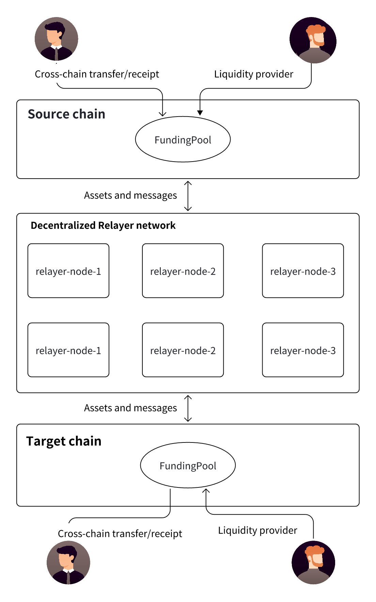

# Cross-chain Abstraction

## 

###

This architecture describes a Decentralized Cross-Chain Bridge solution, which relies on the core components of FundingPool (liquidity funding pool) and a decentralized Relayer network to enable secure and efficient transfer of assets and messages between different blockchains. Below is a detailed breakdown of the solution:

## Source Chain

FundingPool:
- Responsible for locking user assets on the source chain to ensure funds are available.
- Allows liquidity providers (LP) to deposit funds to support liquidity needs for cross-chain transactions.
- Sends assets and messages to the decentralized Relayer network.

Users:
- Perform cross-chain transfers on the source chain and deposit assets into the FundingPool.
- Can receive the corresponding assets on the target chain.

Liquidity Providers:
Deposit assets into the FundingPool to support cross-chain transfer needs.

## Decentralized Relayer Network

Relayer nodes (relayer-node-1, 2, 3):
- Listen for cross-chain transaction events from the FundingPool.
- Responsible for relaying assets and messages to the FundingPool on the target chain.
- Maintain a decentralized relay network to enhance transaction reliability and resistance to censorship.

## Target Chain

FundingPool (Liquidity Pool):
- Receives assets and messages transmitted by the Relayer network.
- Releases the corresponding assets to the target users.
- Allows liquidity providers (LPs) to deposit funds to support cross-chain transaction liquidity.

Users: Receive cross-chain funds on the target chain. 
Liquidity Providers: Deposit funds on the target chain to support cross-chain transaction needs.

This solution combines FundingPool + decentralized Relayer network to achieve decentralized, efficient, and liquidity-rich cross-chain transactions. Cross-chain fund management is conducted through the liquidity pool, and multiple Relayer nodes are used to transmit cross-chain transaction information, ensuring transaction security, censorship resistance, and efficiency. This is suitable for multi-chain ecosystems and Web3 application scenarios.