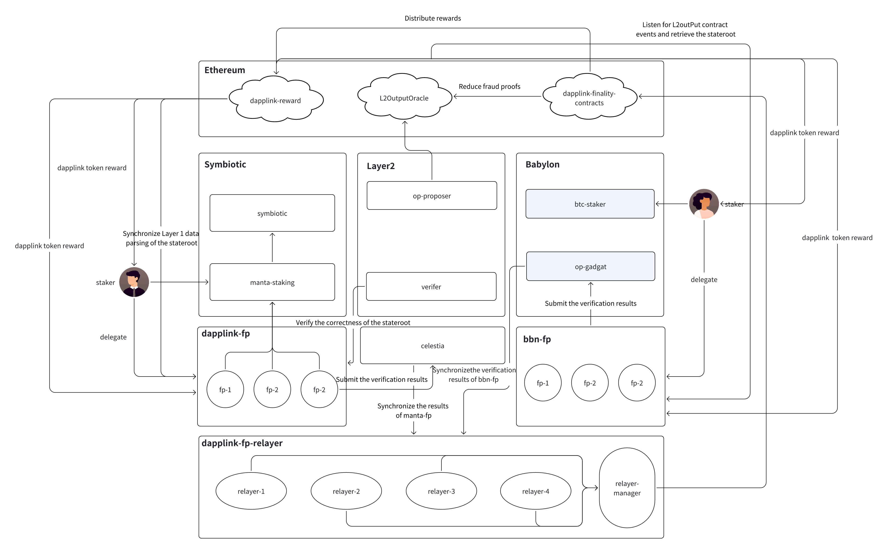

# Fast verification network abstraction

##

###
The final fast verification network is designed to achieve rapid finality of blocks on the Layer 2 network and quick withdrawals on Layer 1, while also providing security assurance protocols.

While ensuring security, the following two functions are achieved:
- Rapid finalization of Layer 2 blocks
- Reduced fraud proof time and quick confirmation of Layer 1 withdrawals

Dual-protocol staking security model: The security of the final fast verification network is ensured by the Babylon and Symbiotic protocols.

In the fast verification network, there are two types of FP networks:
- FP network based on Babylon staking
- FP network based on Symbiotic staking

On Babylon, BTC stakers will stake BTC to Babylon and delegate their staking weight to the FP (Fast Verification Network Node) network. The FP network nodes will commit signatures for the stateroot on Layer 2. Once a certain number of node signatures are achieved, the Leader node of the FP network will aggregate the signatures and submit them to the Babylon network. These signatures are validated on the Babylon network and then await synchronization with the Relayer network.

On Symbiotic, stakers will stake the project tokens to SymbioticFi and delegate their staking weight to the corresponding FP (Fast Verification Network Node) network. The FP network nodes will commit signatures for the stateroot on Layer 2. Once a certain number of node signatures are achieved, the signed message will be pushed to the Relayer network.

After the Relayer nodes validate the commitment signatures submitted by both parties, and after meeting the required number of Relayer validations:
- The Layer 2 block can be finalized, achieving rapid finality for the Manta network's Layer 2 block.
- The Relayer Manager will submit the commitment signatures, staking information, and stateroot to Ethereum. After Layer 1 validation, the fraud proof time will be proportionally reduced based on the FP staking amount, completing the rapid withdrawal from the Layer 2 network.