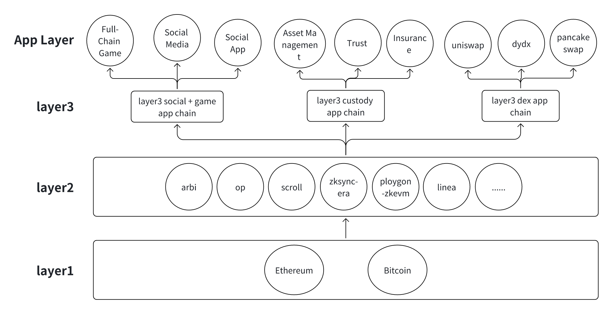

# Modular and composable Layer3
##

###

In the current Web3 ecosystem, many decentralized applications are developing rapidly, such as social products, gaming products, hosting products, and trading products. Based on this development trend, Layer3 protocols that can be launched include: social + gaming Layer3 app chain protocol, hosting Layer3 app chain protocol, and trading Layer3 app chain protocol. From a market perspective, the social + gaming user base is likely to be larger and have the widest audience. Therefore, the best practice is to first launch the social + gaming Layer3 app chain protocol, followed by the Layer3 hosting and Layer3 trading app chains. For Savourlabs, we are first launching the social + gaming Layer3 app chain, then the Layer3 hosting app chain, and finally the Layer3 trading app chain. Savourlabs' vision is to build a universal Layer3 protocol that can run on any Layer 2 chain, such as Ethereum's Layer3, Bitcoin's Layer 2, etc.