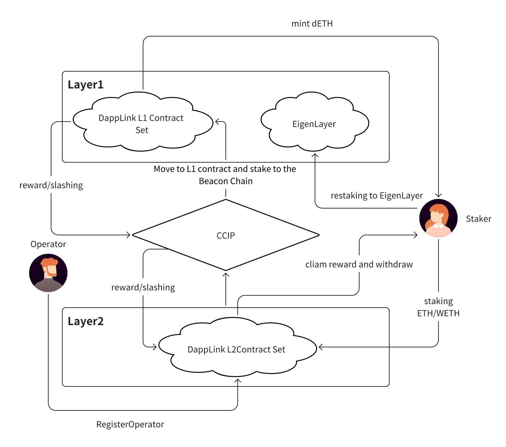

# Multi Staking Protocol

## 

###

This solution combines EigenLayer, DappLink L1/L2, and CCIP to achieve ETH staking, cross-chain Restaking, operator incentives, and penalty mechanisms, with the following advantages:

- ETH stakers can earn EigenLayer Restaking rewards, improving capital efficiency.
- A decentralized operator mechanism allows L2 operators to register and participate in on-chain operations, earning incentives.
- Cross-chain CCIP transmits L1-L2 staking information to ensure synchronized execution of incentives and penalties.
- Compatible with L2 ecosystems, applicable to Rollup staking, validator economic models, and cross-chain validation mechanisms.

This architecture is suitable for Web3 validator networks, Restaking economic systems, and cross-chain Rollup solutions, effectively enhancing the security, decentralization, and fairness of the economic incentive system in Layer 2.