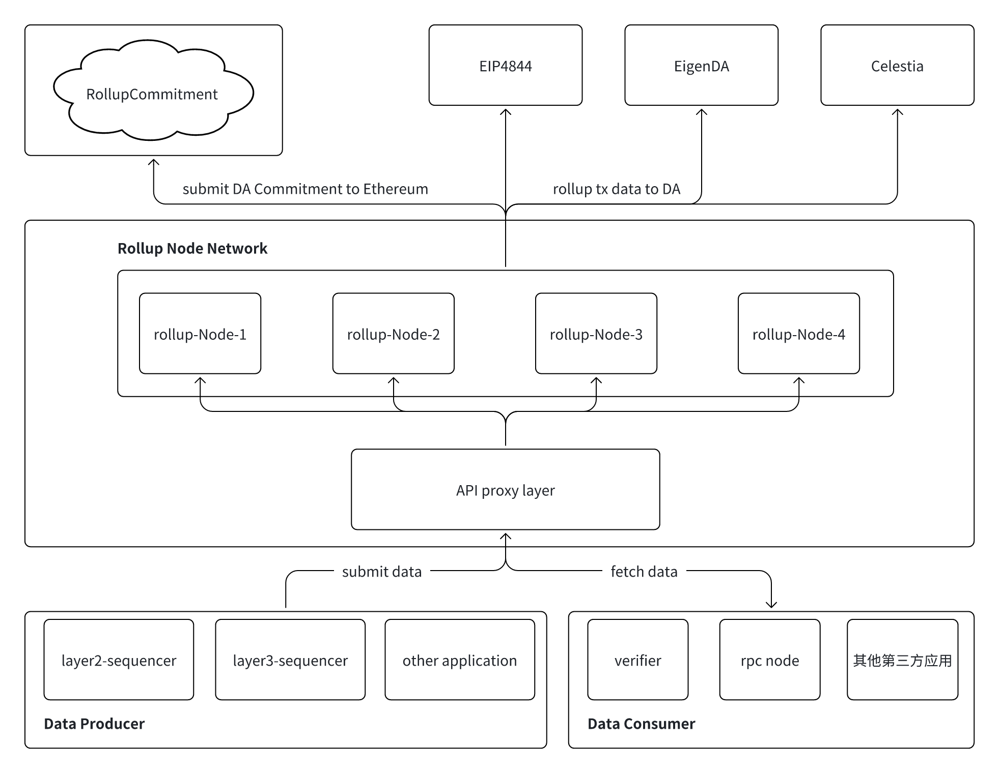
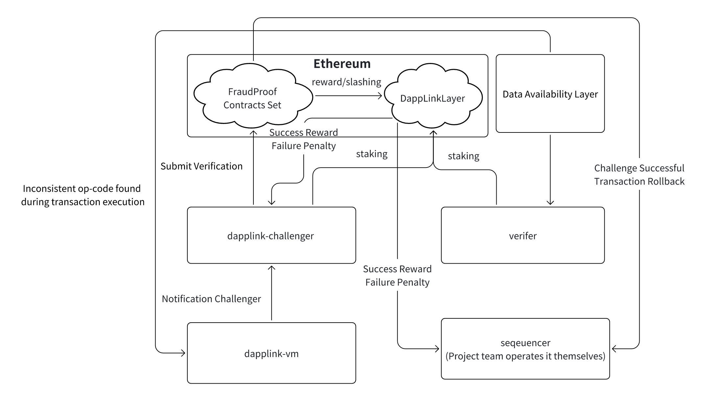
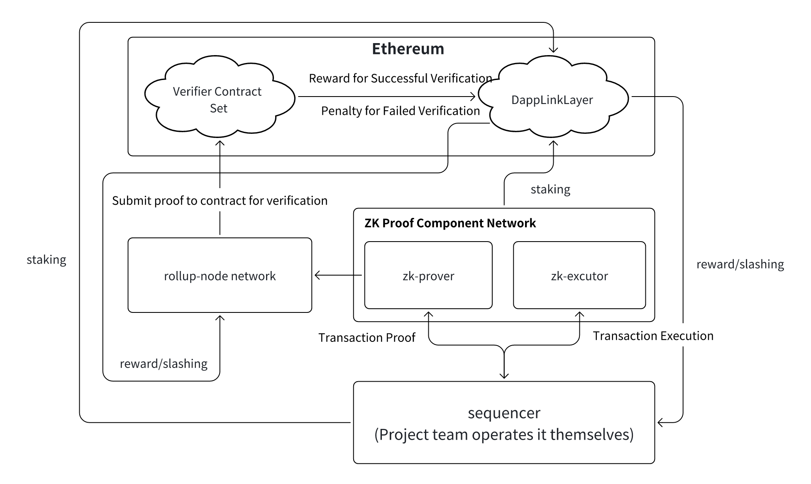

# Rollup and Proof System Abstraction

## 1.Rollup of Transaction Data

The solution above constructs a Rollup Node network that handles Layer2 or Layer3 transaction data and submits it to different Data Availability (DA) layers. Data producers and consumers interact with the Rollup Node through an API proxy layer to ensure the integrity and availability of Rollup transaction data.

The Data Availability (DA) layer, this solution supports multiple data availability schemes, including:
- EIP-4844 (Ethereum native DA scheme, using Blob transactions to store Rollup data)
- EigenDA (DA scheme within the EigenLayer ecosystem)
- Celestia (Modular DA solution in the Cosmos ecosystem)
- NearDA (Data availability layer from Near Inc.)
- AnyTrust (Arbi DAC Committee data availability layer project)
Rollup data can be submitted to these DA schemes, with some DA projects' data commitments still being submitted to Ethereum to ensure security and verifiability.

Rollup Node Network
- Composed of multiple Rollup nodes (e.g., rollup-node-1, rollup-node-2, etc.). 
- These nodes receive data through the API proxy layer and process Rollup transactions. 
- The network is responsible for aggregating and ordering Rollup data, and submitting it to the DA layer. 

API Proxy Layer: This layer serves as the entry point for the Rollup network, connecting data producers and data consumers.

Data Producers (Submit Data):
- Layer2 Sequencer
- Layer3 Sequencer
- Other applications (e.g., decentralized social platforms, DeFi exchanges)

Data Consumers (Fetch Data):
- Verifier (Used for Rollup state validation)
- RPC Nodes (Provide blockchain data query services)
- Other Third-Party Applications (Possibly including block explorers, analytics tools, etc.)

Data Flow
- Data Submission: Layer2 / Layer3 Sequencers and other applications submit transaction data through the API proxy layer
- Rollup Processing: The Rollup Node network receives data, packages Rollup transactions, and submits them to DA schemes (EIP-4844, EigenDA, Celestia)
- Data Consumption: Verifiers, RPC nodes, and other third-party applications can fetch Rollup transaction data from the API proxy layer.

Features and Advantages
- Supports multiple DA schemes, compatible with Ethereum's EIP-4844 and third-party DA solutions (EigenDA, Celestia).
- Decentralized Rollup network, with multiple Rollup nodes collaborating to process transactions, enhancing network reliability.
- Flexible API layer, allowing different types of applications to submit and consume data, improving Rollup data accessibility and ecosystem compatibility.

This technical solution is designed around the storage, submission, and consumption of Rollup data, integrating EIP-4844, EigenDA, Celestia, NearDA, and AnyTrust as Data Availability layers to build a scalable Rollup Node network. Through the API proxy layer, it interacts with external applications. This architecture enhances the security, availability, and scalability of Rollup transactions and is suitable for Layer2, Layer3, and other Web3 application scenarios.

## 2.Transaction Proof Rollup

- Fraud Proof: Primarily used in optimistic rollups, where the assumption is that the sequencer is not malicious, but we optimistically acknowledge that the sequencer may have a risk of malicious behavior. Fraud proofs are used to prevent the sequencer and its related components from acting maliciously.
- Validity Proof: Primarily used in zk (Zero-Knowledge Proof) rollups, where a zk proof is generated for each transaction. The zk proof is generated off-chain and then submitted to the chain for verification.

### 2.1.Fraud Proof Module Abstraction

This architecture diagram describes a Fraud Proof mechanism, combined with DappLinkLayer and Ethereum, to ensure the correctness of transaction execution and allow challengers to verify and challenge inconsistent transaction execution results. Below is a detailed breakdown of the solution:

Ethereum (Mainnet):
- Runs the FraudProof Contracts Set, which is used to receive and validate challenge requests.
- DappLinkLayer handles the reward/slashing mechanism.
- Interacts with DappLinkLayer (the availability layer).

Sequencer:
- Operated by the project team, responsible for processing and ordering transactions.
- Submits transaction data to the data availability layer for storage.

Verifier:
- Monitors transaction data; if errors are found, challenges can be submitted.
- Successful challenges can lead to transaction rollbacks. 

DappLink-VM (Execution Environment):
- Responsible for executing transactions.
- If inconsistencies are found in the op-code results during transaction execution, it notifies DappLink-Challenger to initiate a challenge.

DappLink-Challenger (Challenger):
- Responsible for receiving anomalous transactions discovered by DappLink-VM and submitting challenge verification requests.
- Interacts with the fraud proof contract.

This solution builds an expandable fraud proof mechanism, suitable for Layer2 / Layer3 Rollup ecosystems. Through staking, challenge validation, transaction rollbacks, and reward/slashing mechanisms, it ensures decentralized transaction security, ensuring the trustworthiness of transaction data submitted by the sequencer. At the same time, it allows challengers to identify errors and initiate challenges, making the entire system more secure, transparent, and trustworthy.

### 2.2.Validity Proof Module Abstraction

This solution is centered around the Zero-Knowledge Proofs (ZK Proofs) mechanism, ensuring that the transaction data submitted by the Sequencer is correct and generates verifiable proofs through the ZK Proof Component, which are then submitted to the Verifier Contract Set on Ethereum for validation. The core components include:

Ethereum (Mainnet):
- Runs the Verifier Contract Set (ZK Proof Verification Smart Contracts), used to receive and validate ZK proofs.
- DappLinkLayer handles the reward/slashing mechanism.

Sequencer:
- Operated by the project team, responsible for processing and ordering transactions.
- Generates transaction data and submits it to the ZK proof component for execution and verification.

ZK Proof Component Network:
- zk-prover (ZK Proof Generator): Based on transaction execution results, generates ZK proofs to ensure the transaction data is correct and immutable.
- zk-executor (ZK Executor): Executes the transactions and provides execution results to the zk-prover.

Rollup-Node Network:
- Responsible for collecting ZK proofs and submitting them to the Verifier Contract Set for validation.
- Ensures node behavior correctness through the staking mechanism and maintains network security through the reward/slashing mechanism.

This solution adopts the ZK Rollup approach, forming a complete ZK transaction processing architecture through the Sequencer, ZK Proof Component, Rollup-Node, and Ethereum Validation. It ensures the correctness of transactions, data availability, and economic security. This solution not only enhances the security and privacy of Rollup transactions but also maintains the economic incentive balance of the entire system through staking and slashing mechanisms, making it an efficient and secure Layer2 and Layer3 solution.
