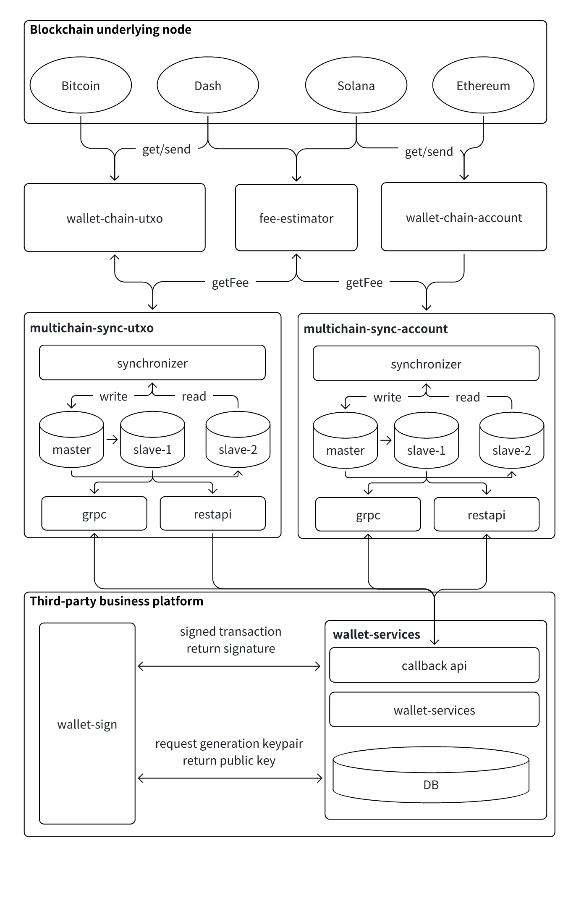
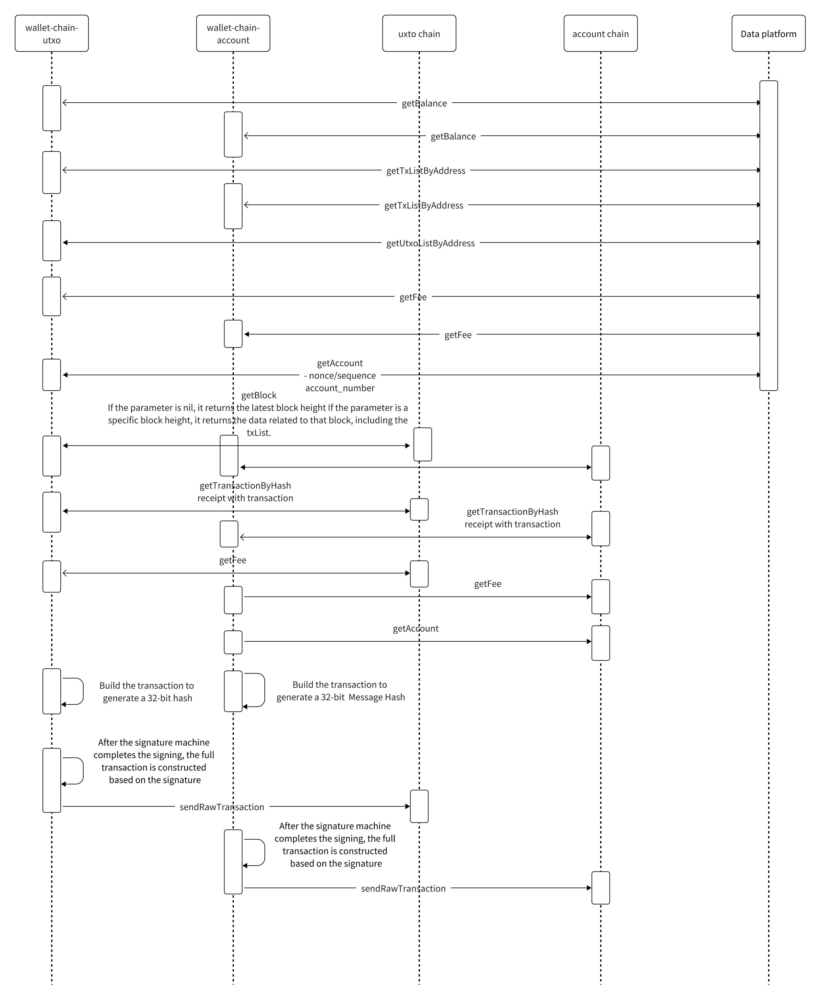

# Centralized wallet business process
##



- Address Generation Process
    - The business party schedules the signature machine to generate a key pair, with the private key stored in the signature machine, and the public key returned via the interface
    - The business calls the gRPC interface, passing in the public key list to generate addresses. multichain-sync-utxo/multichain-sync-account schedules the underlying service to generate addresses based on the public key and returns the address list to the business party.
- Blockchain Scanning Process
    - When recharging: The synchronizer service listens for blocks, parses transactions, and processes them into the database
    - Recharge: The withdrawal address is an external address, and the deposit address is the exchange user's address
    - Withdrawal: The withdrawal address is the hot wallet address, and the deposit address is an external address
    - Aggregation: The withdrawal address is the user's address, and the deposit address is the hot wallet address
    - Hot-to-warm transfer: The withdrawal address is the hot wallet address, and the deposit address is the warm wallet address
    - Warm-to-hot transfer: The withdrawal address is the warm wallet address, and the deposit address is the hot wallet address
- Withdrawal
    - Call multichain-sync's BuildUnSignTransaction to build a 32-byte MessageHash
    - Use the MessageHash to sign in the signature machine and return the signature
    - Send the transaction requestId and signature to multichain-sync, construct the complete transaction, and send it to the blockchain network
    - The withdrawal task in multichain-sync constantly scans transactions and sends them to the blockchain. Once sent, it notifies the business layer that the transaction has been sent
    - After scanning the withdrawal transaction, it notifies the business layer that the withdrawal is successful
- Aggregation, Hot-to-Warm and Warm-to-Hot transfer business logic is similar to the withdrawal process

## 1.Unified RPC service Gateway


## 2.wallet-chain-utxo Implemented interfaces
```
GetSupportChains(req *utxo.SupportChainsRequest) (*utxo.SupportChainsResponse, error)
ConvertAddress(req *utxo.ConvertAddressRequest) (*utxo.ConvertAddressResponse, error)
ValidAddress(req *utxo.ValidAddressRequest) (*utxo.ValidAddressResponse, error)
GetFee(req *utxo.FeeRequest) (*utxo.FeeResponse, error)
GetAccount(req *utxo.AccountRequest) (*utxo.AccountResponse, error)
GetUnspentOutputs(req *utxo.UnspentOutputsRequest) (*utxo.UnspentOutputsResponse, error)
GetBlockByNumber(req *utxo.BlockNumberRequest) (*utxo.BlockResponse, error)
GetBlockByHash(req *utxo.BlockHashRequest) (*utxo.BlockResponse, error)
GetBlockHeaderByHash(req *utxo.BlockHeaderHashRequest) (*utxo.BlockHeaderResponse, error)
GetBlockHeaderByNumber(req *utxo.BlockHeaderNumberRequest) (*utxo.BlockHeaderResponse, error)
SendTx(req *utxo.SendTxRequest) (*utxo.SendTxResponse, error)
GetTxByAddress(req *utxo.TxAddressRequest) (*utxo.TxAddressResponse, error)
GetTxByHash(req *utxo.TxHashRequest) (*utxo.TxHashResponse, error)
BuildUnSignTransaction(req *utxo.UnSignTransactionRequest) (*utxo.UnSignTransactionResponse, error)
BuildSignedTransaction(req *utxo.SignedTransactionRequest) (*utxo.SignedTransactionResponse, error)
DecodeTransaction(req *utxo.DecodeTransactionRequest) (*utxo.DecodeTransactionResponse, error)
VerifySignedTransaction(req *utxo.VerifyTransactionRequest) (*utxo.VerifyTransactionResponse, error)
```
- GetSupportChains: Query if a chain is supported
- ConvertAddress: Export address from public key
- ValidAddress: Check if the address format is correct
- GetFee: Estimate transaction fee
- GetAccount: Get account-related information, such as balance
- GetUnspentOutputs: Get the list of unspent transaction outputs
- GetBlockByNumber: Get block information based on the block number, including transaction list. If empty is passed, the latest block will be returned; if a block number is passed, information for that block will be returned.
- GetBlockByHash: Get block information based on block hash, including transaction list
- GetBlockHeaderByHash: Get block header information based on block hash
- GetBlockHeaderByNumber: Get block header information based on block number
- SendTx: Broadcast the signed transaction
- GetTxByAddress: Get transaction records related to the given address
- GetTxByHash: Get transaction details based on TxHash
- BuildUnSignTransaction: Generate a 32-byte MessageHash to be signed from the transaction data
- BuildSignedTransaction: Build the complete transaction using the signature returned by the signature machine and the transaction information
- DecodeTransaction: Decode the rawTx to obtain the original transaction
- VerifySignedTransaction: Verify the signed transaction

## 3.wallet-chain-account Implemented interfaces
```
type IChainAdaptor interface {
    GetSupportChains(req *account.SupportChainsRequest) (*account.SupportChainsResponse, error)
    ConvertAddress(req *account.ConvertAddressRequest) (*account.ConvertAddressResponse, error)
    ValidAddress(req *account.ValidAddressRequest) (*account.ValidAddressResponse, error)
    GetBlockByNumber(req *account.BlockNumberRequest) (*account.BlockResponse, error)
    GetBlockByHash(req *account.BlockHashRequest) (*account.BlockResponse, error)
    GetBlockHeaderByHash(req *account.BlockHeaderHashRequest) (*account.BlockHeaderResponse, error)
    GetBlockHeaderByNumber(req *account.BlockHeaderNumberRequest) (*account.BlockHeaderResponse, error)
    GetAccount(req *account.AccountRequest) (*account.AccountResponse, error)
    GetFee(req *account.FeeRequest) (*account.FeeResponse, error)
    SendTx(req *account.SendTxRequest) (*account.SendTxResponse, error)
    GetTxByAddress(req *account.TxAddressRequest) (*account.TxAddressResponse, error)
    GetTxByHash(req *account.TxHashRequest) (*account.TxHashResponse, error)
    GetBlockByRange(req *account.BlockByRangeRequest) (*account.BlockByRangeResponse, error)
    BuildUnSignTransaction(req *account.UnSignTransactionRequest) (*account.UnSignTransactionResponse, error)
    BuildSignedTransaction(req *account.SignedTransactionRequest) (*account.SignedTransactionResponse, error)
    DecodeTransaction(req *account.DecodeTransactionRequest) (*account.DecodeTransactionResponse, error)
    VerifySignedTransaction(req *account.VerifyTransactionRequest) (*account.VerifyTransactionResponse, error)
    GetExtraData(req *account.ExtraDataRequest) (*account.ExtraDataResponse, error)
}
```
- GetSupportChains: Query if a chain is supported
- ConvertAddress: Convert public key to address
- ValidAddress: Validate if the address format is correct
- GetFee: Estimate transaction fee
- GetAccount: Get account-related information, such as balance
- GetBlockByNumber: Get block information by block number, including transaction list. If empty is passed, the latest block is returned; if a block number is passed, information for that block is returned
- GetBlockByHash: Get block information by block hash, including transaction list
- GetBlockHeaderByHash: Get block header information by block hash
- GetBlockHeaderByNumber: Get block header information by block number
- GetBlockByRange: Get block information for a range of blocks, specified by start and end block numbers
- SendTx: Broadcast signed transaction
- GetTxByAddress: Get transaction records for a specific address
- GetTxByHash: Get transaction details by TxHash
- BuildUnSignTransaction: Generate a 32-byte MessageHash to be signed from transaction data
- BuildSignedTransaction: Build the complete transaction using the signature returned by the signature machine and the transaction information
- DecodeTransaction: Decode rawTx to get the original transaction
- VerifySignedTransaction: Verify a signed transaction
- GetExtraData: Reserved interface

## 4.multichain-sync-account/utxo service
```
service BusinessMiddleWireServices {
  rpc businessRegister(BusinessRegisterRequest) returns (BusinessRegisterResponse) {}
  rpc exportAddressesByPublicKeys(ExportAddressesRequest) returns (ExportAddressesResponse) {}
  rpc buildUnSignTransaction(UnSignWithdrawTransactionRequest) returns(UnSignWithdrawTransactionResponse){}
  rpc buildSignedTransaction(SignedWithdrawTransactionRequest) returns(SignedWithdrawTransactionResponse){}
  rpc setTokenAddress(SetTokenAddressRequest) returns (SetTokenAddressResponse) {}
}
```
- businessRegister: Third-party businesses need to register in the system before they can use the full wallet service
- exportAddressesByPublicKeys: Batch generate addresses based on public keys
- createUnSignTransaction: Generate a 32-byte MessageHash to be signed from transaction data
- buildUnSignTransaction: Build the complete transaction using the signature returned by the signature machine and the transaction information
- setTokenAddress: Businesses configure the tokens they need to support based on their requirements


