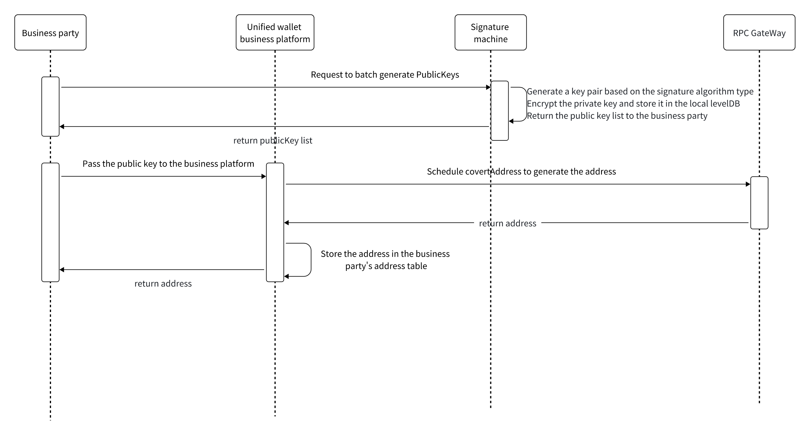

# Batch Address Generation
##

- The business schedules its own signature to generate keys, with the private key never leaving the TEE or CloudHSM. However, the public key list will be returned to the business.
- The business provides the public key list to Multichain, which then schedules wallet-chain-account/utxo to export addresses based on the public keys.
- The generated address list is stored in the business table and the address list is returned.