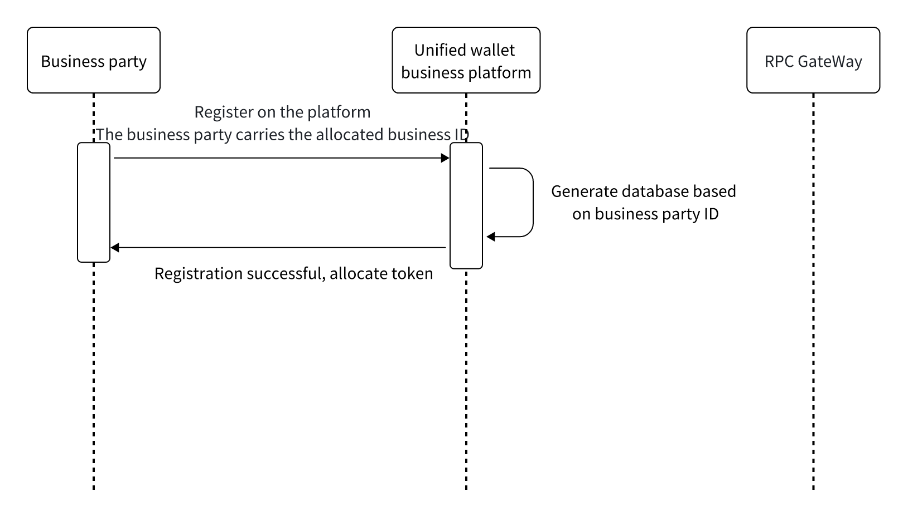

# Merchant ID Configuration
##

- Register with our DappLink wallet platform using the Merchant ID. Internally, the system will partition and manage the database based on the business.
- During business registration, the relevant callback interfaces for deposit, withdrawal, transaction records, etc., must be submitted to the DappLink wallet platform.