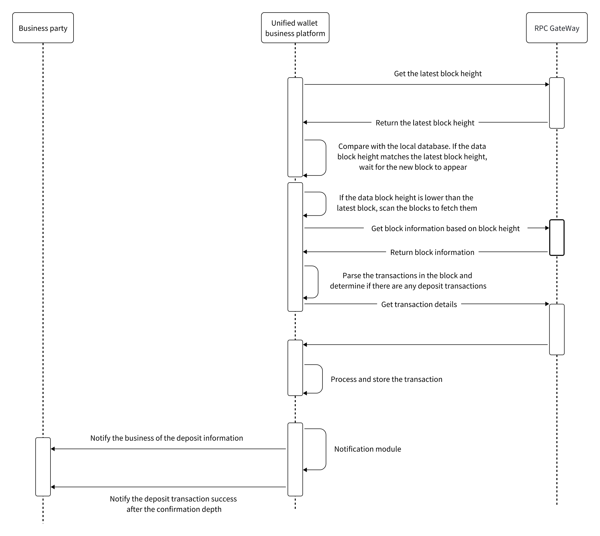

# Recharge Business
##

- Get the latest blockchain block.
- Get the highest block from local data.
- Compare the latest block on the chain with the highest block in the database.
- If the local data block height = the latest block height on the chain, wait for the new block to appear.
- If the local data block height > the latest block height on the chain, perform transaction rollback.
- If the local data block height < the latest block height on the chain
- Get the transaction list based on the block height.
- After parsing the transactions
  - If the "from" address is an external address and the "to" address is an internal user address, it's a recharge. Call the callback interface to notify the business.
  - If the "from" address is a user address and the "to" address is a hot wallet address, it's a consolidation. Call the callback interface to notify the business.
  - If the "from" address is a hot wallet address and the "to" address is an external user address, it's a withdrawal. Call the callback interface to notify the business.
  - If the "from" address is a hot wallet address and the "to" address is a cold wallet address, it's a hot-to-cold transfer. Call the callback interface to notify the business.
  - If the "from" address is a cold wallet address and the "to" address is a hot wallet address, it's a cold-to-hot transfer. Call the callback interface to notify the business.