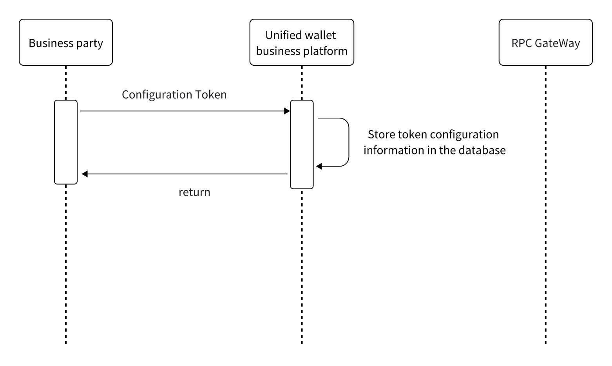

# Business Configures Token
## 

- The business configures the token by providing the token name, symbol, precision, minimum and maximum aggregation, cold storage financial information, and other related details.