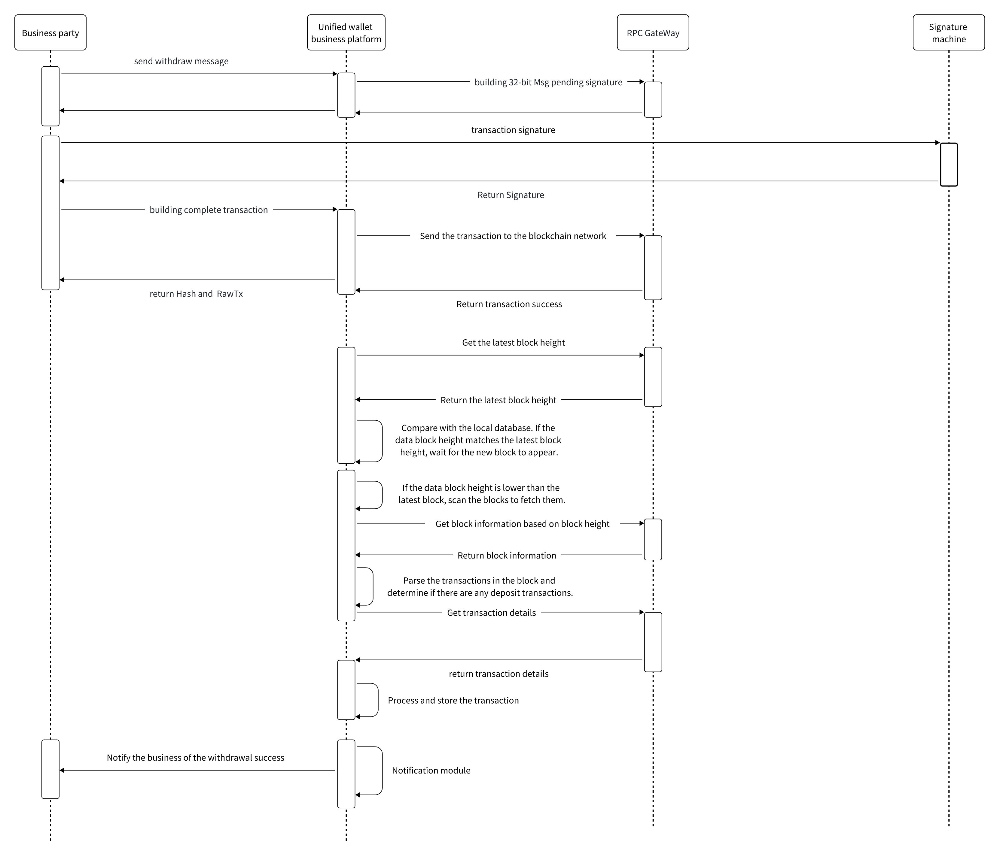

# Withdrawal Process
##

- The user initiates a withdrawal, and the business sends the withdrawal transaction to the DappLink wallet service.
- The business sends the transaction to multichain-sync-account/utxo to build the message to be signed. multichain-sync-account/utxo schedules wallet-chain-account/utxo to return the message to be signed.
- The business sends the message to be signed to its own deployed signature service for signing.
- The business sends the signature and transaction ID to multichain-sync-account/utxo, which then schedules wallet-chain-account/utxo to build the complete transaction and sends it to the blockchain network, returning the complete transaction and transaction hash to the business side.
- The withdrawal process will scan these transactions and send them to the blockchain network.
- The scanning part of the process refers to the recharge module.