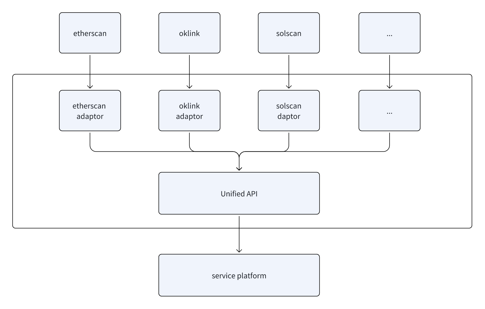

# Unified Browser API Code Library {#dapplink-wallet}

Chain Explorer API is a unified browser interface gateway that simplifies the calling process of browser APIs, provides a unified imported parameter exported parameter underlying call library, and helps third-party projects simplify the development process.

### System Architecture
- Unified Entry Point: Offers a standardized API interface to receive user requests and perform parameter validation.
- Parameter Handling Module: Standardizes input parameters to ensure compatibility with internal modules.
- Third-Party Service Adapters: Invokes different third-party blockchain explorer services based on standardized parameters to retrieve the required data.
- Response Handling Module: Processes data obtained from third-party services, unifies the output format, and returns it to the user.
### Workflow
- Request Reception: Users send requests through the unified entry point, including the desired blockchain information and related parameters.
- Parameter Standardization: The Parameter Handling Module standardizes user input to ensure it meets internal processing requirements.
- Service Invocation: Based on the standardized parameters, the appropriate third-party service adapter is selected to call the corresponding blockchain explorer service for data retrieval.
- Data Processing: The Response Handling Module parses and formats the retrieved data to ensure consistency in the output.
- Result Return: The processed data is returned to the user through the unified entry point, completing the API call process.

