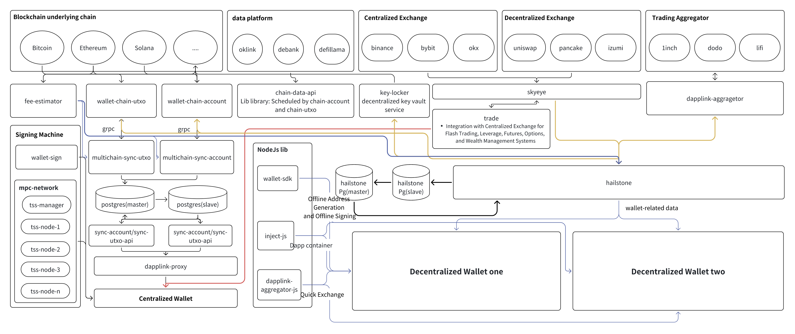

# DappLink Core Function
##

The DappLink one-click wallet deployment platform is composed of multiple core components to ensure security, scalability, and high performance

key-locker: On-chain key management tool, supporting blockchains such as Ethereum, IPFS, Arweave, etc.

Signature Machine: DappLink’s signature machine supports two modes: CloudHSM and TEE (Trusted Execution Environment). Currently, it supports ECDSA and EdDSA encryption algorithms and has been adopted by multiple vendors. The signature machine ensures the security of transaction signatures and can adapt to different security needs.

MPC Network: DappLink adopts MPC and ZK technologies for decentralized key management mechanisms, dynamic signing committees, suitable for enterprise-level wallets and compliance custody needs.

wallet-sdk: Provides standardized interfaces with multi-chain support, enabling developers to quickly integrate wallet functionality. It mainly includes:
- Address generation 
- Transaction signing 
- Asset queries 
- On-chain interaction

Unified gRPC Interface Service: Provides a unified gRPC interface, integrates third-party data platforms, and supports various blockchain models. This component offers a consistent API design, enabling different types of blockchains to interact through the same interface.
- chain-data-api: Unified wallet API for connecting to third-party platforms, mainly serving HD wallets. 
- wallet-chain-account: Suitable for account models (Ethereum, Solana, etc.)
- wallet-chain-utxo: Suitable for UTXO models (Bitcoin, Litecoin, BCH, BSV, etc.)

Unified Blockchain Scan Service: DappLink features robust on-chain data synchronization and monitoring capabilities, supporting transaction processing for both account models and UTXO models. For account model chains: multichain-sync-account and for UTXO model chains: multichain-sync-utxo. This module ensures that the wallet can track on-chain changes in real time and efficiently handle asset transfers. The module includes the following functions:
- Business configuration
- Address export
- Deposit & withdrawal
- Asset aggregation
- Hot-to-cold and cold-to-hot transfers
- Transaction rollback and other business logic

Data and transaction services
- skeye: Unified market data service, integrating CEX and DEX, providing real-time market data.
- trade: Supports centralized wallet features like flash trading, leverage, futures, and options insurance, with future integration plans for exchanges.
- Decentralized Flash Trading: Optimizes trading paths through Aggregator APIs to improve exchange efficiency.

Hailstone Business Middleware: Hailstone is the business middleware within the DappLink ecosystem, responsible for interfacing with upper-level business systems, providing efficient and stable middle-layer services. Hailstone enables seamless wallet integration with various Web3 applications, enhancing business integration capabilities. Main features include:
- User account management
- Transaction risk control
- Data analysis
- Cross-chain interaction
- Dapp aggregation

