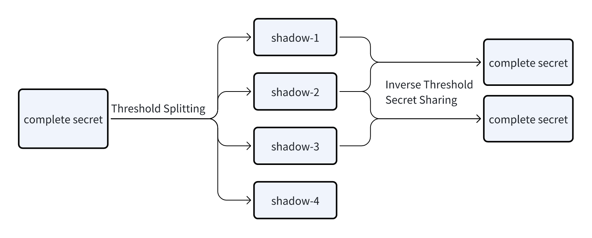

# Underlying Library for Threshold Secret Sharing Algorithms {#dapplink-wallet}

Dapplink-Secret is a foundational library developed based on the Shamir threshold secret sharing algorithm, with optimizations made on the original implementation. The library aims to provide a simple and secure solution for secret sharing and recovery. It is built with JavaScript and supports usage in both Node.js and browser environments, with compatibility for global variables and AMD module loading.
Features Overview
- Secret Splitting: Allows splitting any "secret" into n "shares."
    - Examples of secrets: Passwords, text files, Bitcoin private keys, etc.
    - Share size: Each share is the same size in bits as the original secret.
- Threshold Recovery: Any t (threshold) shares can be used to reconstruct the original secret.
  Key Features
- Cross-platform Support: Compatible with Node.js and browser environments, supporting both global variables and AMD module loading.
- High Security: Based on the mathematically robust Shamir threshold sharing algorithm, ensuring the safety of secrets.
- Flexibility: Applicable to various use cases, including password storage, distributed key management, and more.
  Use Cases
- Password Management: Split a password into multiple shares and distribute them to different custodians for enhanced security.
- Key Backup: Store Bitcoin private keys or other critical keys in a distributed manner to prevent single points of failure.
- File Security: Protect important files and manage access through threshold secret sharing.

The following is a flowchart of the algorithm with 4 as the number of split keys and 2 as the threshold value.

