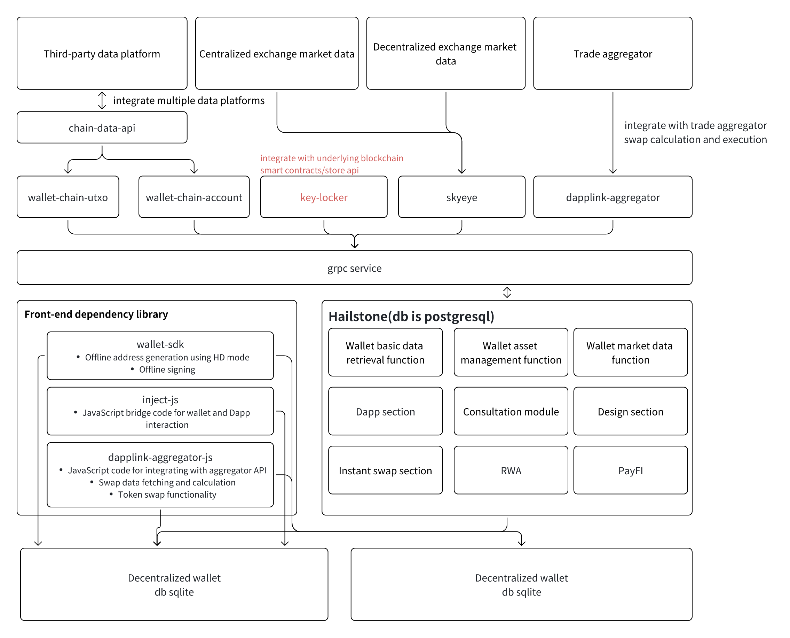
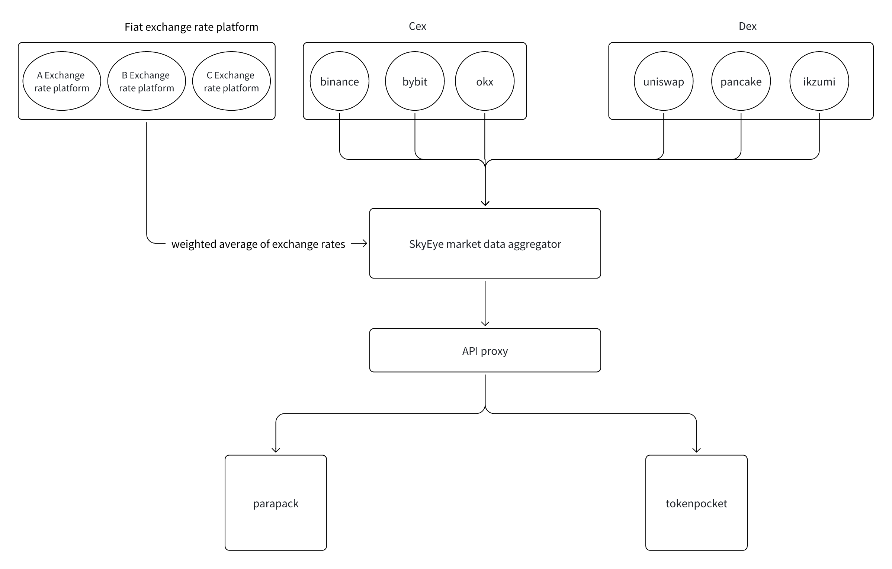
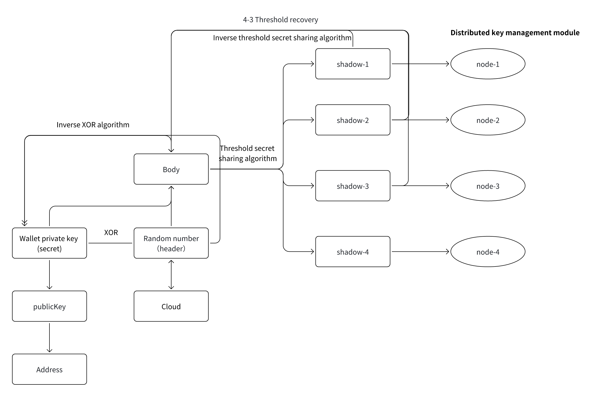

# Decentralized Wallet Services
##

Data Collection and Integration: Collect data from third-party data platforms, centralized exchange market data, decentralized exchange market data, and trading aggregators.
- Integrate and process multiple data sources via chain-data-api
- skyeye and dapplink-aggregator handle trading calculations, exchanges, and aggregation, providing data support for trading aggregators

Blockchain Account and UTXO Processing:
- Handle UTXO account data through wallet-chain-utxo
- Process blockchain data based on account models via wallet-chain-account
- key-locker: Decentralized key vault component

Hailstone Wallet Backend Services:
- Wallet Data Management: Basic management of user wallet information
- Wallet Asset Management: Storage and management of wallet assets
- Wallet Market Data: Real-time querying of market prices for wallet assets
- Dapp Module: Provide business support for Dapp-related functions
- Consultation Module: Provide market or product consultation information
- Instant Exchange Module: Provide fast exchange functionality
- RWA (Real-World Assets): Support the on-chain mapping of real-world assets
- PayFI: Provide payment and financial functions

Frontend Dependency Libraries, Providing Wallet Interaction and Transaction Aggregation Functions:
- wallet-sdk: Generates offline wallet addresses, supports HD (Hierarchical Deterministic) mode, and performs offline signing
- inject-js: Handles JS bridge code for wallet and Dapp interaction
- dapplink-aggregator-js: Provides JS code for the trading aggregator API; handles data extraction and calculations, supports currency exchange functionality
- parapack (SQLite) and fishcake (SQLite): Used for local data storage, possibly for caching or lightweight data storage needs

## 1.Market Data Services

- Regularly pull market data from various exchanges
- After obtaining trading pair data, remove the lowest and highest values
- Perform weighted average calculation, and compute the 24-hour price change based on your own data
- Calculate the total network 24-hour trading volume and average trading volume based on the exchange's trading volume

## 2.Key Custody Services

- The wallet private key is combined with a random number using the XOR algorithm to form the Body
- The random number is used as the Header, which is uploaded to the cloud
- The Body is split using the threshold secret sharing algorithm into multiple shadows, and each shadow is stored across multiple distributed nodes
- During recovery, the inverse threshold secret sharing algorithm is used to combine a sufficient number of shadows to recover the Body
- Retrieve the Header from the cloud, and use the inverse XOR algorithm with the Body to restore the original wallet private key