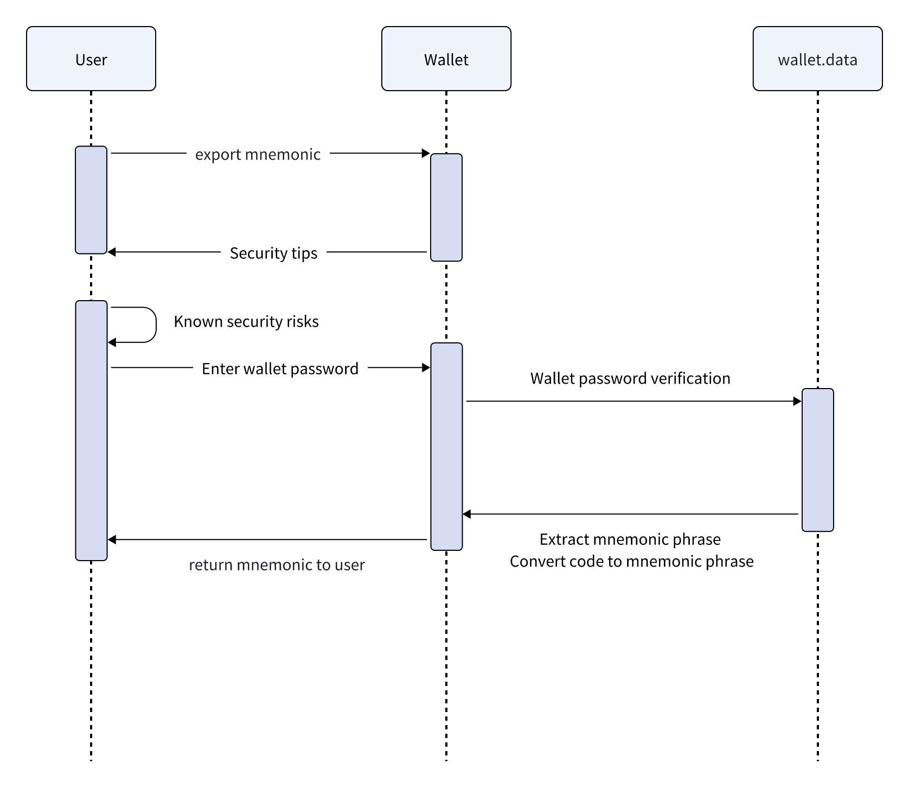

# Mnemonic Export
##

The DappLink solution follows the same derivation model as other HD wallets. When importing the DappLink wallet mnemonic into another wallet, the generated private key, public key, and address will be the same (Note: some blockchains have multiple address formats. If different wallets choose different address formats, the generated addresses might differ).
###

