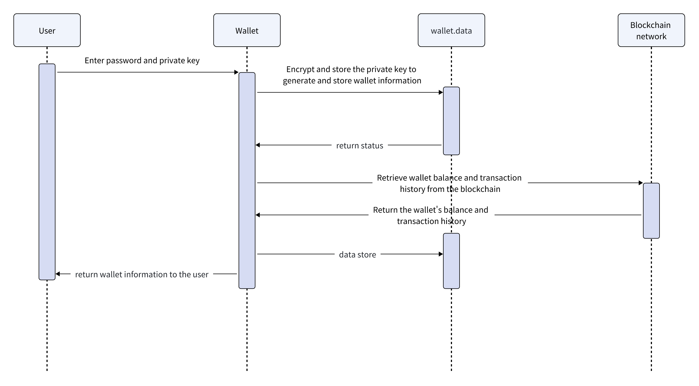

# Private Key Import
##

Note: The private key import can only generate the addresses associated with that specific private key. However, the mnemonic phrase can manage multiple wallets (account, address_index) through the BIP derivation protocol.