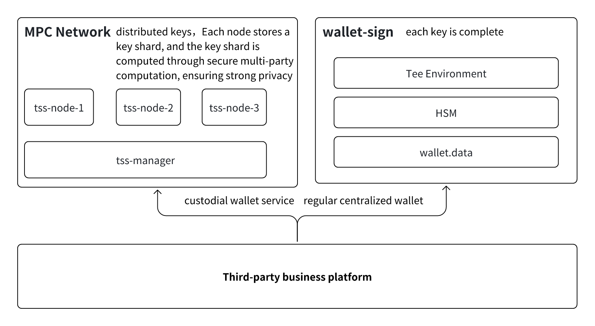

# Unified signature service business process
##



This service is deployed in a TEE (Trusted Execution Environment), typically deployed by the business party themselves, with technical support provided by DappLink. The supported interfaces are as follows.

```
rpc getSupportSignWay(SupportSignWayRequest) returns (SupportSignWayResponse) {}
rpc exportPublicKeyList(ExportPublicKeyRequest) returns (ExportPublicKeyResponse) {}
rpc signTxMessage(SignTxMessageRequest) returns (SignTxMessageResponse) {}
```
- getSupportSignWay:Check if the signature method is supported
    - ECDSA
        - secp256k1
        - secp256r1
    - EdDSA
        - Ed25519
        - tm-ed25519
    - RSA
- exportPublicKeyList:  keygen After completion, output the public key
- signTxMessage：The function for signing the transaction

