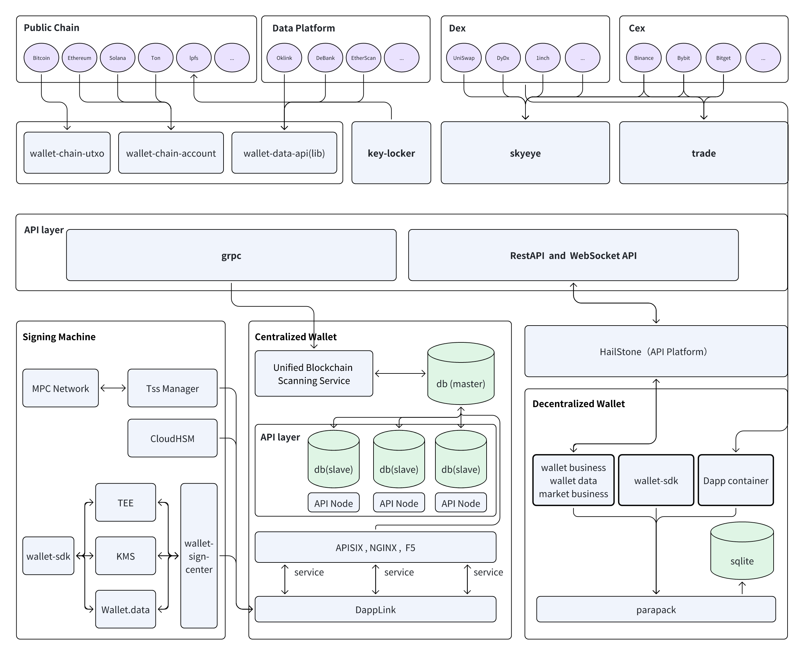

# System Architecture {#dapplink-wallet}

- wallet-chain-utxo:  Unified encapsulation of wallet RPC interface of utxo chain
- wallet-chain-account:  Unified encapsulation of wallet RPC interface of account chain
- chain-data-api:  The unified wallet API that connects to third-party platforms is mainly used by HD wallets.
- key-locker: On-chain key management tool, currently connected to Ethereum, IFPS, Ar and other chains
- skyeye: Unified market service, docking CEX and DEX
- trade: Projects that support flash swaps, leverage, futures and options insurance for centralized wallets, and are later connected to exchanges
- hailstone: Unified API and business center
- tss network: mpc network, Node deployed in a TEE environment
- wallet-sdk：Multi-chain offline address and offline signature SDK
- wallet-sign-center: Support java, go, node, etc.
- Unified Blockchain Scanning Service：Support multi-tenant, centralized wallet business components
- API：API to support third-party scheduling wallet business
- Dapp Container：Support various Dapps and wallets to interact
- Decentralized flash swap: Scheduling Aggregator API