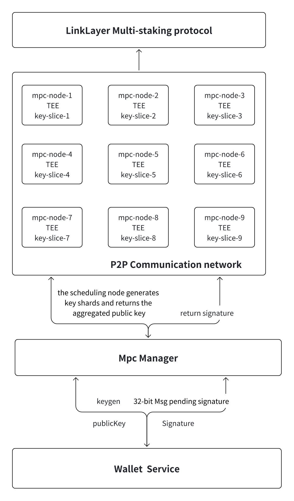

# MPC Custody System
## 

- LinkLayer Multi-Stake Protocol: As the top-level protocol of the entire system, it is responsible for coordinating the joining and exiting management of MPC nodes. It ensures network security and reliability through a staking model and commitment signatures.
- MPC Node Layer: Composed of multiple MPC nodes running in TEE environments, each node holds a slice of the key (key-slice).
- mpc-node-1 to mpc-node-9: Each node operates in a TEE environment, and key slices are distributed across the nodes to ensure no single node can directly reconstruct the full key.
- TEE (Trusted Execution Environment): Provides hardware-level security to prevent malicious actions from tampering with or leaking key slices.
- P2P Communication Network:
    - Nodes work together through a peer-to-peer communication network.
    - Supports distributed computation for key generation (keygen) and signature (signature) operations.
    - Key Generation: Nodes collaborate to generate key slices and aggregate the public key through computation.
    - Signature: Nodes receive the message to be signed, compute independently, and return the result. Finally, the signatures are aggregated into a complete signature.
    - MPC Manager: Responsible for managing MPC operations, including key generation and signature requests.
- Core Functions:
    - keygen: Triggers the key generation process and returns the generated public key (publicKey).
    - Signature: Receives the 32-byte message (Msg) to be signed, coordinates MPC nodes to complete the signing process, and returns the result.
- Wallet Service:
    - A service module aimed at the business layer.
    - Interacts with the MPC Manager to send key generation and signature requests.
    - Provides core wallet services such as key management and transaction signing.

