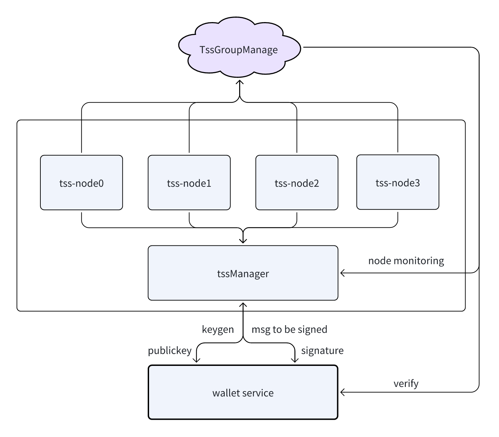

# MPC Network {#dapplink-wallet}

### System Components
- tssGroupManage (On-Chain Contract):
  A smart contract deployed on the blockchain responsible for managing and registering TSS nodes, as well as implementing a punishment mechanism for malicious nodes.
- tss-node (TSS Node):
  Independent nodes participating in the TSS network. Each node is deployed individually and registers with the tssGroupManage contract.
- tssManager (Management Layer):
  An entity responsible for overseeing all tss-node instances. It serves as the entry point for external services requiring signature authentication.
### Workflow Overview
- Node Deployment and Registration:
    - Each tss-node is deployed in the TSS network environment.
    - Upon deployment, nodes register themselves with the tssGroupManage smart contract on the blockchain.
    - The tssGroupManage contract maintains a registry of active TSS nodes.
- Node Management:
    - The tssManager monitors and manages the registered tss-node instances.
    - It ensures nodes are functioning correctly and coordinates their activities within the TSS network.
- Signature Authentication Process:
    - External services requiring signature authentication interact with the system through the tssManager.
    - The tssManager coordinates with the appropriate tss-node instances to perform the necessary cryptographic operations.
    - Utilizing the TSS protocol, the nodes collaboratively generate the required signatures without exposing individual private keys.
    - The generated signature is verified through the tssGroupManage contract to ensure its validity.
- Punishment Mechanism:
    - The tssGroupManage contract implements a mechanism to monitor and punish malicious nodes.
    - If a node is detected engaging in malicious behavior, the contract enforces appropriate penalties to maintain system security and reliability.