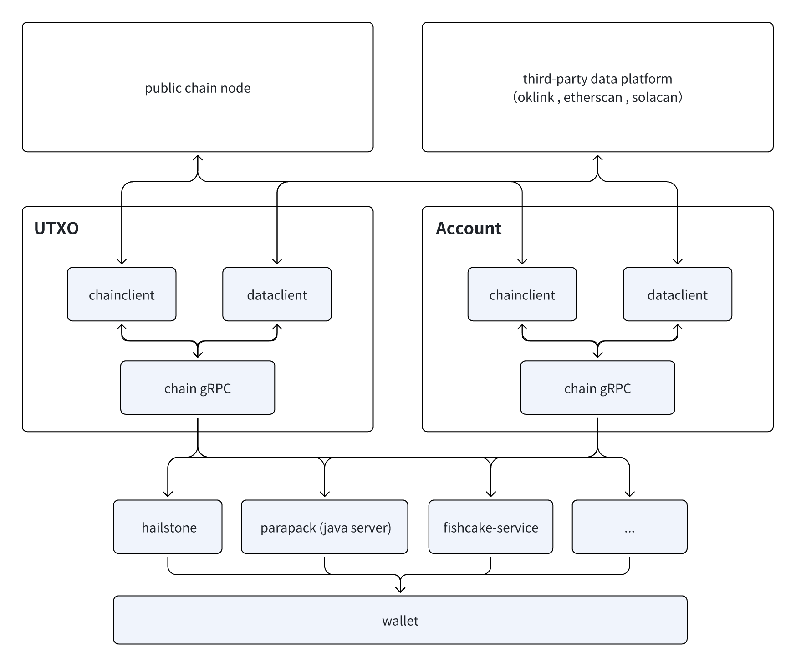

# Unified RPC Interface Service {#dapplink-wallet}

The diagram above illustrates the basic architecture of the Unified RPC Service. This service standardizes the interfaces across different blockchains and aggregates data into a unified data platform. Based on the Unified RPC Service, third-party services can efficiently retrieve data by calling the Chain gRPC interface.

- UTXO: Provides a unified RPC interface service for blockchains using the UTXO model.
- Account：Provides a unified RPC interface service for blockchains using the Account model.

This architecture significantly simplifies the complexity of cross-chain data interaction and offers developers an efficient and standardized way to access blockchain data.