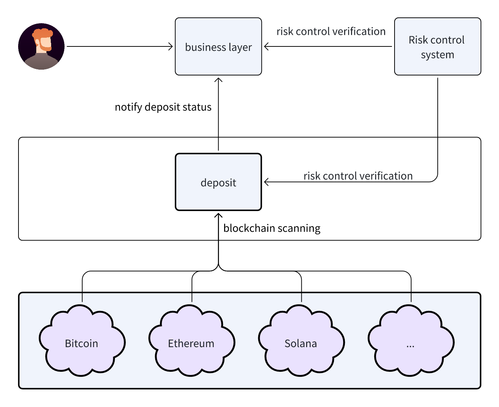
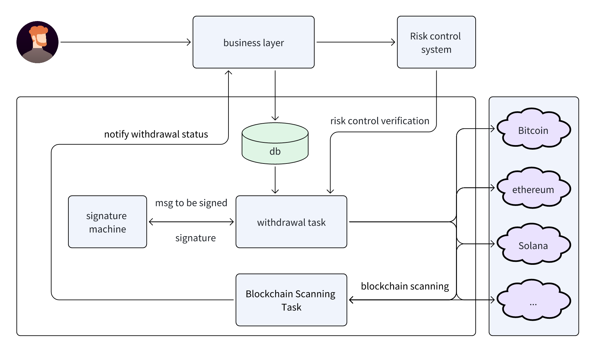
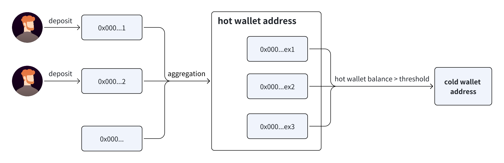

# Unified Wallet Services for Deposit, Withdrawal, Aggregation, Cold Transfer, and Risk Control {#dapplink-wallet}

A unified wallet service for deposits, withdrawals, aggregation, cold storage transfers, and risk control. It features real-time monitoring of on-chain transactions, supporting multiple chains and asset types. The real-time risk control system monitors all transactions, identifies, and blocks suspicious activities, providing a secure, efficient, and cost-effective on-chain asset management solution for users and businesses.

Here is a flowchart for some of the business processes.
### Deposit

### Withdrawal

### Aggregation，Cold storage，Hot storage

