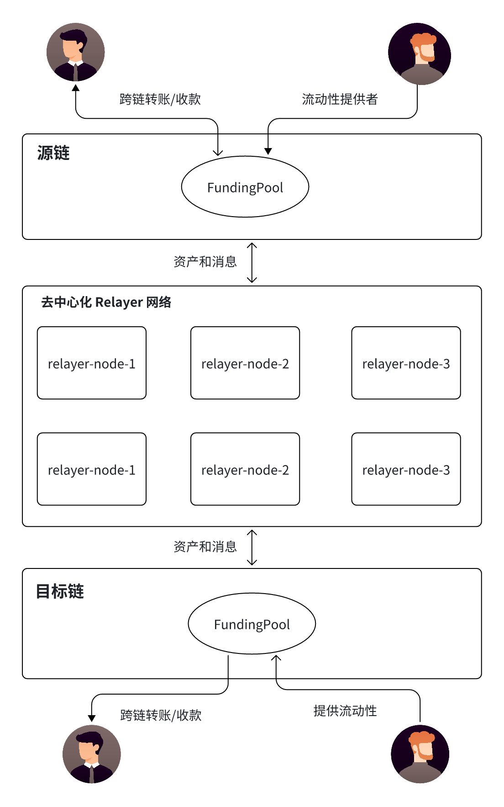

# 跨链抽象

该架构描述了一种去中心化跨链桥（Decentralized Cross-Chain Bridge） 方案，核心依赖 FundingPool（流动性资金池） 和去中心化 Relayer 网络，实现资产和消息在不同区块链之间的安全、高效流转。以下是该方案的详细解析：

## 1.源链
-  FundingPool：
    - 负责锁定用户在源链上的资产，确保资金可用。
    - 允许流动性提供者（LP）存入资金，以支持跨链交易的流动性需求。
    - 发送资产和消息到去中心化 Relayer 网络。
- 用户：
    - 在 源链进行跨链转账，向 FundingPool 存入资产。
    - 可在目标链上接收相应资产。
- 流动性提供者:  向 FundingPool 存入资产，以支持跨链转账需求

## 2.去中心化 Relayer 网络
- Relayer 节点（relayer-node-1、2、3）：
- 监听 FundingPool 的跨链交易事件
- 负责将资产和消息中继到目标链上的 FundingPool。
- 维护去中心化的中继网络，提高交易可靠性和抗审查能力

## 3.目标链
- FundingPool（流动性池）：
    - 接收 Relayer 网络传输的资产和消息。
    -  释放相应的资产给目标用户。
    - 允许流动性提供者（LP）存入资金，以支持跨链交易流动性。
- 用户： 在目标链上收到跨链资金。
- 流动性提供者: 在目标链上存入资金，以支持跨链交易需求。

该方案结合 FundingPool + 去中心化 Relayer 网络，实现去中心化、高效、流动性充足的跨链交易。通过流动性资金池 进行跨链资金管理，并利用 多个 Relayer 节点 传输跨链交易信息，确保交易的安全性、抗审查性和高效性，适用于多链生态和 Web3 应用场景。

