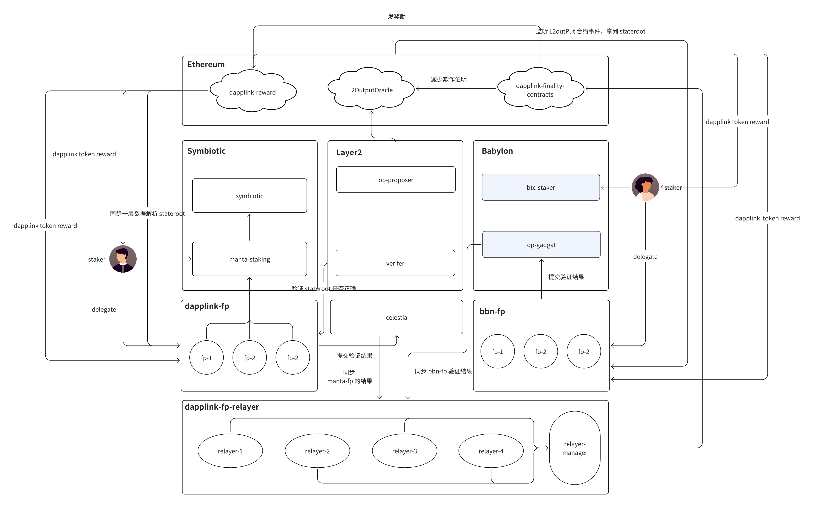

# 快速验证网络抽象

最终快速验证网络是一个为了实现二层网络上的区块快速最终确定性和一层快速提现， 同时提供安全保障协议。

保证安全的同时实现以下两个功能：
- 二层区块快速 Finalized
- 减少欺诈证明的时间，一层提现快速确认

双协议质押安全模型：最终快速验证网络的安全性由 Babylon 和 Symbiotic 协议保障。

在快速验证网络中，我们有两种类型的 FP 网络：
- 基于 Babylon 质押的 FP 网络
- 基于 Symbiotic 质押的 FP 网络

在 Babylon 上，BTC 的质押者将 BTC 质押到 Babylon 并将其质押权重委托给 FP(快速验证网络节点)网络，FP 网络节点对 Layer2 上的 stateroot 进行承诺签名，当达到一定数量的节点签名之后，FP 网络的 Leader 节点将聚合签名提交到 Babylon 网络; 这些签名在 Babylon 网络上验证通过之后，等待 Relayer 网络同步。

在 Symbiotic 上，质押者将项目方代币质押到 SymbioticFi 上并将质押权重委托给对应的 FP(快速验证网络节点) 网络，FP 网络节点对 Layer2 上的 stateroot 进行承诺签名，当达到一定数量的节点签名之后，将签名消息推给 Relayer 网络。

Relayer 的节点验证两方提交的承诺签名之后，满足一定数量的 Relayer 验证之后，
- 二层的区块可以变成 Finalized，完成 Manta 网络二层区块的快速最终确定性。
- Relayer Manager 将承诺签名，质押信息和 stateroot 提交到 Ethereum, 一层验证通过之后，按照 FP 的质押量成比例减少欺诈证明的时间，完成 Layer2 网络的快速提现。
