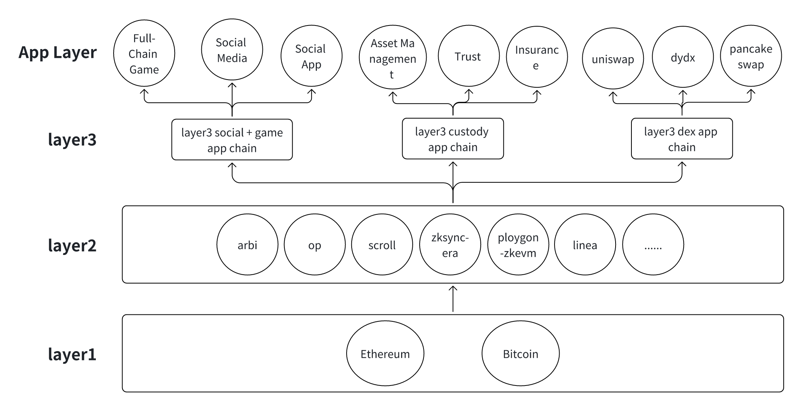

# 模块化可组合 Layer3

在目前的 web3 里面，发展比较快的去中心化应用有很多，例如：社交产品，游戏产品，托管产品和交易产品等,  基于这样的发展趋势，可以推出 layer3 协议有：社交+游戏 layer3 app chain 协议， 托管 layer3 app chain 协议和交易的 layer3 app chain 协议等。从市场角度上看，社交 + 游戏用户群体会更大，受众最广；因此最佳实践是先推出社交+游戏 layer3 app chain 协议，进而推出 layer3 托管和 layer3 交易 app chain；对于 savourlabs 来说，我们率先推出的是社交 + 游戏的 layer3 app chain，然后推出的是 layer3 托管的 app chain，再次是 layer3 交易 app chain。 Savourlabs 的愿景是搭建一个通用型的 layer3 协议，可以运行在任意链的 layer2 上，例如：Ethereum 的 layer3,  Bitcoin 的 layer2 等。
