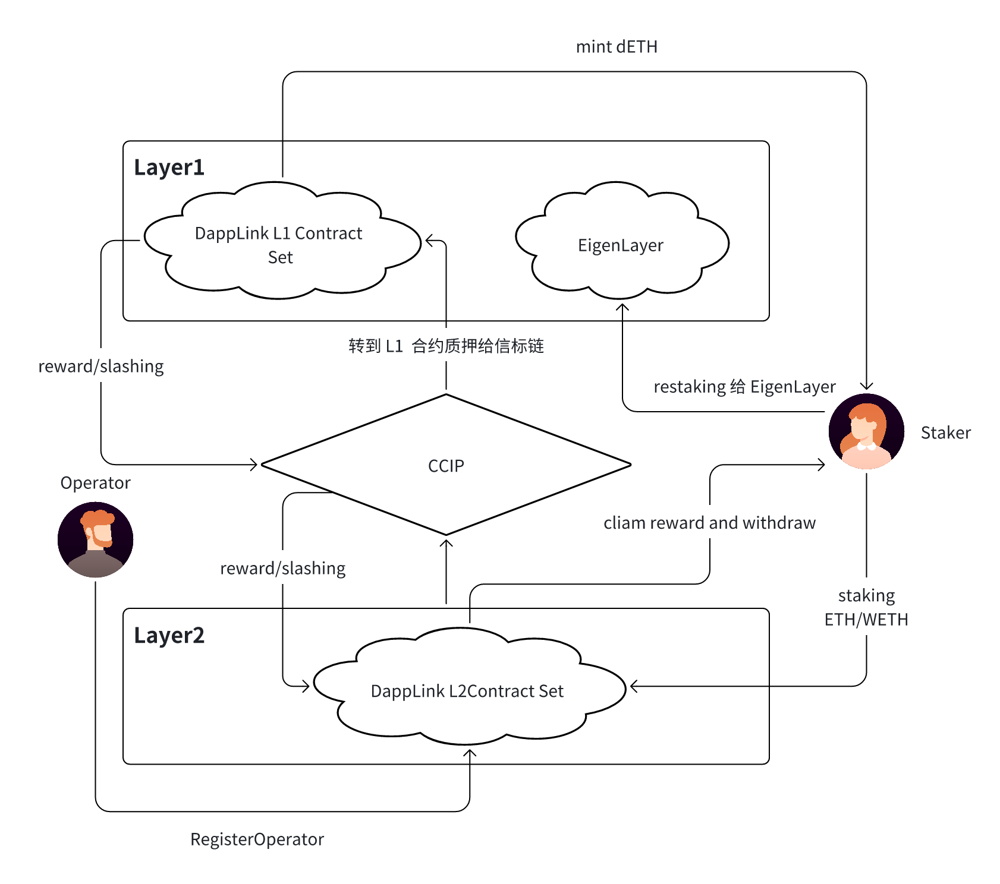

# 多重质押协议

该方案结合 EigenLayer、DappLink L1/L2、CCIP，实现了ETH 质押、跨链 Restaking、运营商激励和惩罚机制，具备以下优点

- ETH 质押者可获得 EigenLayer Restaking 奖励，提高资本利用率
- 去中心化运营商机制，L2 运营商可注册并参与链上运行，获得激励。
- 跨链 CCIP 传输 L1-L2 质押信息，确保激励和惩罚同步执行。
- 兼容 L2 生态，适用于 Rollup 质押、验证者经济模型和跨链验证机制。

该架构适用于 Web3 验证者网络、Restaking 经济系统、跨链 Rollup 解决方案，能够有效提升 Layer2 的安全性、去中心化程度及经济激励体系的公平性。
