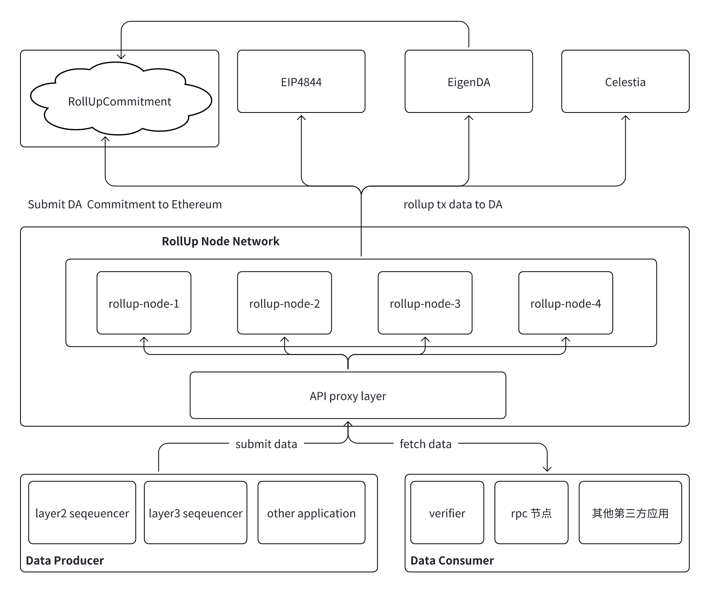
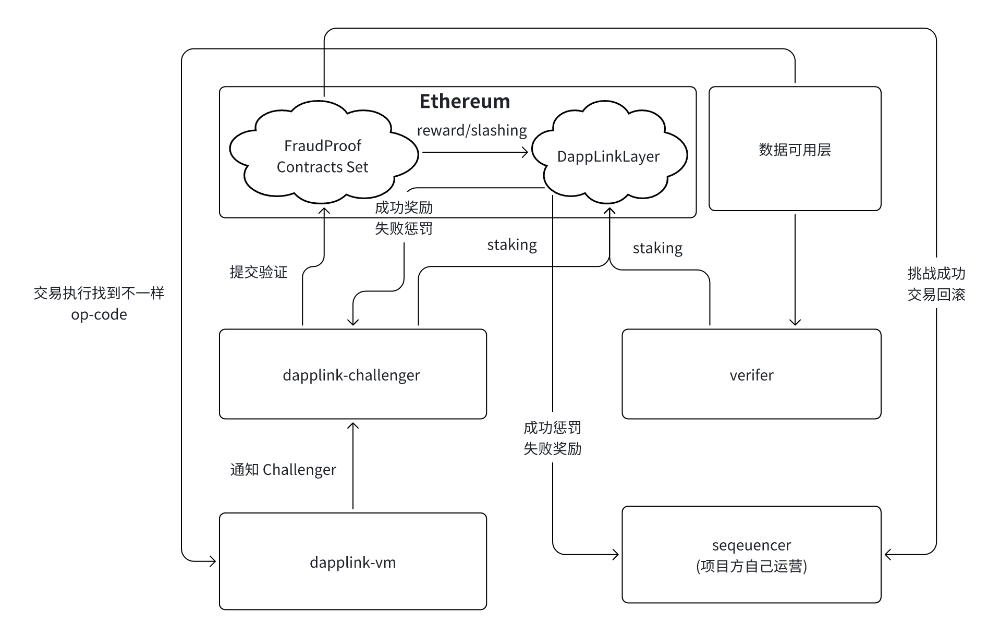
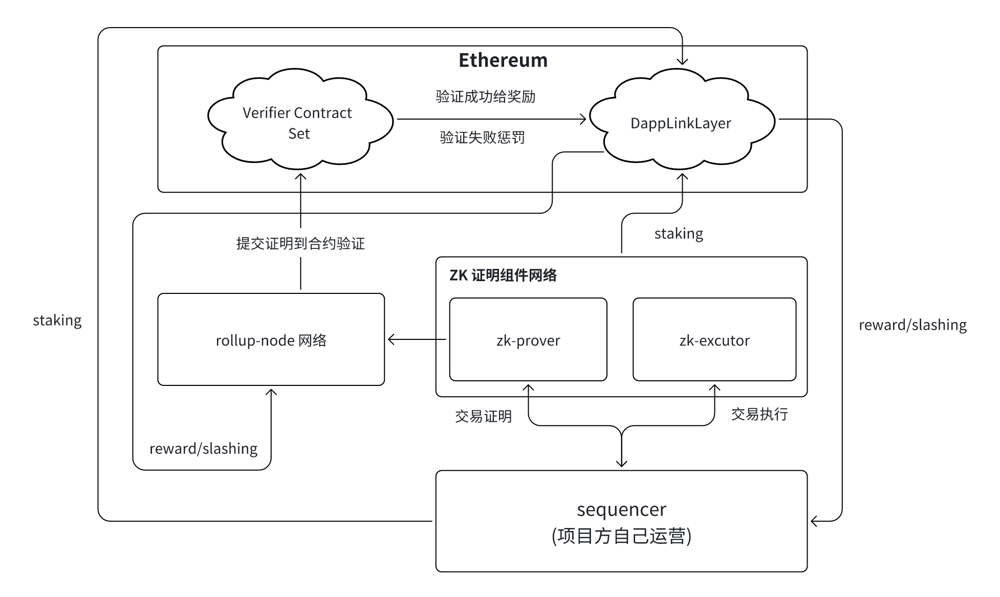

# RollUp  和证明系统抽象

## 1.交易数据的 RollUp

上面方案构建了一个 Rollup Node 网络，用于处理 Layer 2 或 Layer 3 级别的交易数据，并将其提交到不同的数据可用性（DA）层。数据的生产者和消费者通过 API 代理层与 Rollup Node 交互，确保 Rollup 交易数据的完整性和可用性。

数据可用性（DA）层，该方案支持多种数据可用性方案，包括：

- EIP-4844（Ethereum 原生 DA 方案，利用 Blob 交易存储 Rollup 数据）
- EigenDA（EigenLayer 生态中的 DA 方案）
- Celestia（Cosmos 生态模块化 DA 解决方案）
- NearDA（Near 公司的数据可用层）
- AnyTrust（Arbi DAC 委员会数据可用层项目）

Rollup 数据可以提交到这些 DA 方案，同时部分 DA 项目的数据承诺（Commitment）仍然会提交到 Ethereum 以确保安全性和可验证性。

Rollup Node 网络
- 由多个 Rollup 节点 组成（如 rollup-node-1、rollup-node-2 等）。
- 这些节点通过 API 代理层接收数据，并处理 Rollup 交易。
- 该网络负责 Rollup 数据的聚合、排序，并将数据提交到 DA 层。

API 代理层：该层作为 Rollup 网络的入口，连接数据生产者和数据消费者。
数据生产者（提交数据）：
- Layer 2 Sequencer
-  Layer 3 Sequencer
- 其他应用（如去中心化社交、DeFi 交易平台等）

数据消费者（获取数据）：
- Verifier（验证者，用于 Rollup 状态验证）
- RPC 节点（提供区块链数据查询服务）
- 其他第三方应用（可能包括区块浏览器、分析工具等）

数据流
- 数据提交： Layer 2 / Layer 3 Sequencer 和其他应用通过 API 代理层提交交易数据
- Rollup 处理：Rollup Node 网络接收数据，打包 Rollup 交易，并提交到 DA 方案（EIP-4844、EigenDA、Celestia）
-  数据消费：Verifier、RPC 节点和其他第三方应用可从 API 代理层获取 Rollup 交易数据。

特点与优势
- 支持多种 DA 方案，兼容 Ethereum 的 EIP-4844 以及第三方 DA 解决方案（EigenDA、Celestia）
- 去中心化的 Rollup 网络，多个 Rollup 节点协作处理交易，提高网络可靠性
- 灵活的 API 层，允许不同类型的应用提交和消费数据，提升 Rollup 数据的可访问性和生态兼容性

该技术方案主要围绕 Rollup 数据的存储、提交与消费 进行设计，结合 EIP-4844、EigenDA、Celestia、NearDA 和 AnyTrust 作为数据可用性层，构建一个可扩展的 Rollup Node 网络，并通过 API 代理层与外部应用交互。这种架构有助于提升 Rollup 交易的安全性、可用性和可扩展性，适用于 Layer 2、Layer 3 及其他 Web3 应用场景。

## 2.交易证明 Rollup

- 欺诈证明：主要用在 op rollup, 出发点是 sequencer 是不做恶的，但是我们乐观的认为，其实 sequencer 是有做恶的风险，欺诈证明就是用来防止 sequencer 及其相关组件作恶。
- 有效证明：主要用在 zk(基于零知识证明) rollup, 对每一笔交易都进行 zk 证明，链下 zk prove 生成证明，提交到链上验证

### 2.1.欺诈证明模块抽象

该架构图描述了一个 Fraud Proof（欺诈证明） 机制，结合 DappLinkLayer 和 以太坊，用于确保交易执行的正确性，并允许挑战者（Challenger）验证和挑战不一致的交易执行结果。以下是该方案的详细解析：

-  Ethereum（主网）：
- 运行 FraudProof Contracts Set（欺诈证明智能合约集），用于接收和验证挑战请求。
- DappLinkLayer 处理奖励/惩罚（reward/slashing）机制。
- 交互 DappLinkLayer（可用性层）。

- sequencer（排序器）：
    - 由项目方自己运营，负责处理和排序交易。
    - 提交交易数据至数据可用层进行存储。

- verifier（验证者）：
    - 监控交易数据，如发现错误，可提交挑战
    - 成功挑战可导致交易回滚

- dapplink-vm（执行环境）：
    - 负责执行交易。
    - 交易执行过程中如果发现 op-code 结果不一致，会通知 dapplink-challenger 进行挑战

- dapplink-challenger（挑战者）：
    - 负责接收 dapplink-vm 发现的异常交易，并提交挑战验证请求。 
    - 与欺诈证明合约交互。

该方案构建了一个可扩展的欺诈证明机制，适用于 Layer 2 / Layer 3 Rollup 生态。通过 staking、挑战验证、交易回滚、奖励/惩罚 机制，实现去中心化的交易安全保障，确保 sequencer 提交的交易数据可信，同时允许挑战者发现错误并发起挑战，使整个系统更加安全、透明、可信。

## 2.2.有效证明模块抽象

该方案围绕零知识证明（ZK Proofs） 机制，确保 sequencer（排序器） 提交的交易数据是正确的，并通过 ZK 证明组件生成可验证的证明，最终提交到以太坊上的 Verifier Contract Set 进行验证。核心组件包括：
- Ethereum（主网）：
    - 运行 Verifier Contract Set（ZK 证明验证智能合约），用于接收和验证 ZK 证明。
    - DappLinkLayer 处理奖励/惩罚（reward/slashing）机制。

-  Sequencer（排序器）：
    - 由项目方自己运营，负责处理和排序交易。
    - 生成交易数据，并提交至 ZK 证明组件进行执行和验证。

- ZK 证明组件网络：
    - zk-prover（ZK 证明生成器）：基于交易执行结果，生成 ZK 证明，确保交易数据是正确的且不可篡改的。
    - zk-executor（ZK 执行器）：执行交易，并为 zk-prover 提供执行结果。

-  Rollup-Node 网络：
    - 负责收集 ZK 证明，并提交到 Verifier Contract Set 进行验证。
    - 通过 staking 机制 确保节点行为的正确性，并通过 奖励/惩罚机制维护网络安全。

该方案采用 ZK Rollup 方案，通过 Sequencer、ZK 证明组件、Rollup-Node、Ethereum 验证组成完整的 ZK 交易处理架构，确保交易的正确性、数据可用性和经济安全性。该方案不仅提高了 Rollup 交易的安全性和隐私性，而且通过 staking 和 slashing 机制 保障整个系统的经济激励平衡，使其成为高效、安全的 Layer2, Layer3 解决方案。

