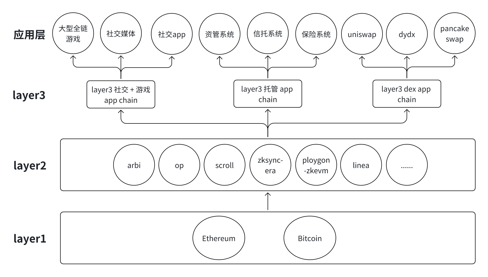

# DappLink Layer3

## 1.什么是 Layer3

Layer3 是构建在 Layer2 之上的去中心化应用协议链（AppChain），其安全性由底层的 Layer1（如 Ethereum、Bitcoin）与 Layer2（如 Arbitrum、OP、zkSync 等）共同保障。
为了保持系统的高可用性、低复杂度和“小而美”的设计原则，Layer3 通常只针对单一应用场景进行优化，例如：

- 去中心化社交与游戏（注重数据交互与高频操作）
- 去中心化托管系统（注重安全性与私钥管理）
- 去中心化交易协议（注重高吞吐与资产结算）

将这些高复杂度的场景拆分为独立的 Layer3 应用链，不仅可以大大简化系统架构，也能提升整体性能与安全性。

## 2.为什么选择 DappLink 通用型 Layer3

随着 Web3 行业的发展，社交、游戏、托管、交易等领域逐渐形成规模化应用趋势。Layer3 AppChain 正迅速成为下一代 Web3 重点基础设施。众多 Layer2 项目（如 Arbitrum、Optimism、ZkSync 等）都在积极布局 Layer3。

在目前的 web3 里面，发展比较快的去中心化应用有社交产品，游戏产品，托管产品和交易产品等,  基于这样的发展趋势， DappLink 推出 layer3 协议有：社交+游戏 layer3 应用链协议， 托管 layer3 和交易的 layer3 应用链。

###### DappLink 提出了一种“通用型 Layer3 基础设施”概念：

可以部署在任何 Layer2 上，支持开发者快速构建符合不同垂直领域需求的 Layer3 AppChain，让项目具备更强的适配能力与更高的成功率。

这意味着，不论你是部署在 Arbitrum、OP 还是 zkSync，只要使用 DappLink 提供的 Layer3 协议，你就能一键启动自己的 Layer3 应用链。

## 3.DappLink Layer3 生态架构一览

DappLink Layer3 不只是一个技术方案，它是一个助力 Web3 应用突破性能、安全与扩展性瓶颈的基础设施平台。通过一站式 Layer3 AppChain 部署方案，DappLink 帮助开发者构建专属的高性能去中心化应用，推动 Web3 应用进入“真实可用”时代。

