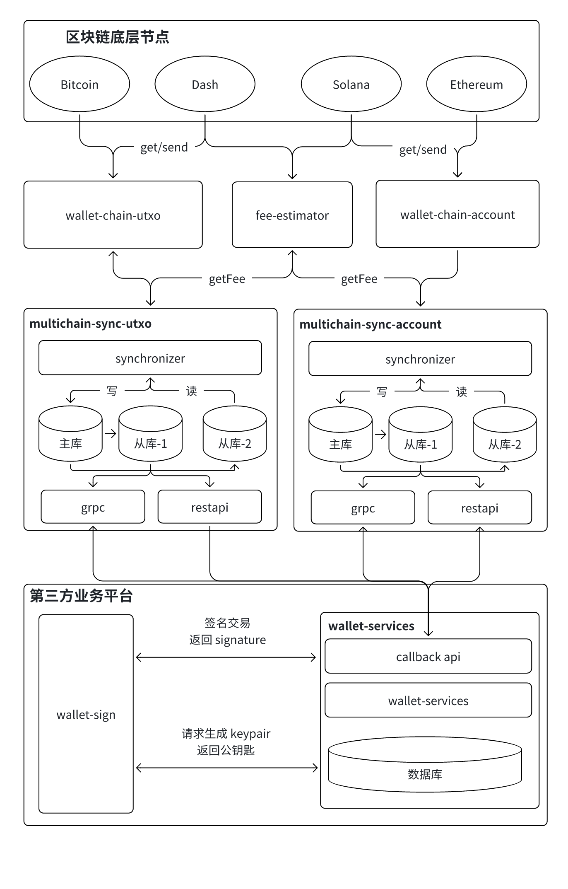
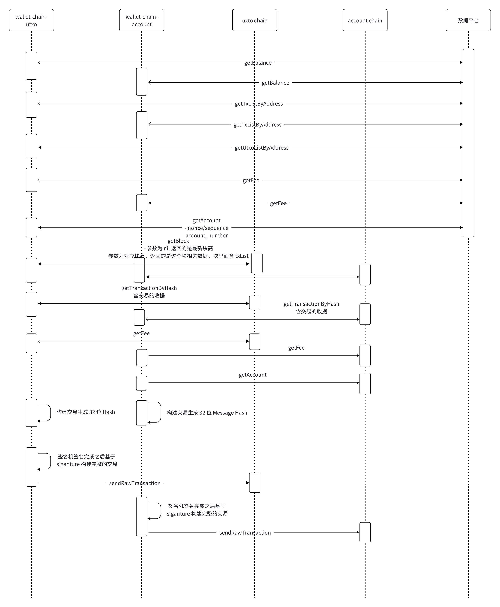

# 中心化钱包业务流程



- 地址生成流程
    - 业务方按照需求调度签名机生成密钥对，私钥存储在签名机里面，公钥通过接口返回
    - 业务调用 gRPC 接口，传入公钥列表，生成地址，multichain-sync-utxo/multichain-sync-account 调度底层服务根据公钥生成地址，并返回地址列表给到业务方。
- 扫链业务流程
    - 充值时：synchronizer 服务监听区块解析交易处理入库
    - 充值：出金地址是外部地址，入金地址是交易所用户地址
    - 提现：出金地址是热钱包地址，入金地址是外部地址
    - 归集：出金地址是用户地址，入金地址是热钱包地址
    - 热转温：出金地址是热钱包地址，入金地址是温钱包地址
    - 温转热：出金地址是温钱包地址，入金地址是热钱包地址
- 提现
    - 调用 multichain-sync 的 BuildUnSignTransaction, 构建 32 个字节的 MessageHash
    - 使用 MessageHash 去签名机里面进行签名，返回来 signature
    - 使用交易的 requestId 和签名发送到 multichain-sync, 构建的完整的并发送到区块网络
    - multichain-sync 的提现任务不断扫交易并发送到区块链，发送完成之后通知业务层，交易已发送
    - 扫到提现交易之后再次通知业务层提现成功
- 归集, 热转温和温转热业务逻辑和提现差不多流程

## 一.统一 RPC 服务 Gateway


## 二.wallet-chain-utxo 实现的接口
```
GetSupportChains(req *utxo.SupportChainsRequest) (*utxo.SupportChainsResponse, error)
ConvertAddress(req *utxo.ConvertAddressRequest) (*utxo.ConvertAddressResponse, error)
ValidAddress(req *utxo.ValidAddressRequest) (*utxo.ValidAddressResponse, error)
GetFee(req *utxo.FeeRequest) (*utxo.FeeResponse, error)
GetAccount(req *utxo.AccountRequest) (*utxo.AccountResponse, error)
GetUnspentOutputs(req *utxo.UnspentOutputsRequest) (*utxo.UnspentOutputsResponse, error)
GetBlockByNumber(req *utxo.BlockNumberRequest) (*utxo.BlockResponse, error)
GetBlockByHash(req *utxo.BlockHashRequest) (*utxo.BlockResponse, error)
GetBlockHeaderByHash(req *utxo.BlockHeaderHashRequest) (*utxo.BlockHeaderResponse, error)
GetBlockHeaderByNumber(req *utxo.BlockHeaderNumberRequest) (*utxo.BlockHeaderResponse, error)
SendTx(req *utxo.SendTxRequest) (*utxo.SendTxResponse, error)
GetTxByAddress(req *utxo.TxAddressRequest) (*utxo.TxAddressResponse, error)
GetTxByHash(req *utxo.TxHashRequest) (*utxo.TxHashResponse, error)
BuildUnSignTransaction(req *utxo.UnSignTransactionRequest) (*utxo.UnSignTransactionResponse, error)
BuildSignedTransaction(req *utxo.SignedTransactionRequest) (*utxo.SignedTransactionResponse, error)
DecodeTransaction(req *utxo.DecodeTransactionRequest) (*utxo.DecodeTransactionResponse, error)
VerifySignedTransaction(req *utxo.VerifyTransactionRequest) (*utxo.VerifyTransactionResponse, error)
```
- GetSupportChains: 可以查询是否支持这条链
- ConvertAddress: 公钥导出地址
- ValidAddress：判断地址格式是否正确
- GetFee: 预估手续费
- GetAccount：获取账户相关的信息，例如：余额
- GetUnspentOutputs：获取未花费的输入输出列表
- GetBlockByNumber：根据区块号获取区块的信息，包含交易列表，若传空，获取到的是最新区块，若传入区块数，获取到的区块的信息
- GetBlockByHash：根据区块哈希获取区块的信息，包含交易列表
- GetBlockHeaderByHash：根据区块哈希获取区块头信息
- GetBlockHeaderByNumber：根据区块号获取区块头信息
- SendTx：广播签名的交易
- GetTxByAddress： 根据地址获取该地址相关的交易记录
- GetTxByHash：根据 TxHash 获取交易详情
- BuildUnSignTransaction：根据交易数据生成待签名的 32 字节的 MessageHash
- BuildSignedTransaction: 用签名机返回的 signature 和交易信息一起构建出完整的交易
- DecodeTransaction：将 rawTx decode 出原始的交易
- VerifySignedTransaction：签名的交易的验证

## 三.wallet-chain-account 实现的接口
```
type IChainAdaptor interface {
    GetSupportChains(req *account.SupportChainsRequest) (*account.SupportChainsResponse, error)
    ConvertAddress(req *account.ConvertAddressRequest) (*account.ConvertAddressResponse, error)
    ValidAddress(req *account.ValidAddressRequest) (*account.ValidAddressResponse, error)
    GetBlockByNumber(req *account.BlockNumberRequest) (*account.BlockResponse, error)
    GetBlockByHash(req *account.BlockHashRequest) (*account.BlockResponse, error)
    GetBlockHeaderByHash(req *account.BlockHeaderHashRequest) (*account.BlockHeaderResponse, error)
    GetBlockHeaderByNumber(req *account.BlockHeaderNumberRequest) (*account.BlockHeaderResponse, error)
    GetAccount(req *account.AccountRequest) (*account.AccountResponse, error)
    GetFee(req *account.FeeRequest) (*account.FeeResponse, error)
    SendTx(req *account.SendTxRequest) (*account.SendTxResponse, error)
    GetTxByAddress(req *account.TxAddressRequest) (*account.TxAddressResponse, error)
    GetTxByHash(req *account.TxHashRequest) (*account.TxHashResponse, error)
    GetBlockByRange(req *account.BlockByRangeRequest) (*account.BlockByRangeResponse, error)
    BuildUnSignTransaction(req *account.UnSignTransactionRequest) (*account.UnSignTransactionResponse, error)
    BuildSignedTransaction(req *account.SignedTransactionRequest) (*account.SignedTransactionResponse, error)
    DecodeTransaction(req *account.DecodeTransactionRequest) (*account.DecodeTransactionResponse, error)
    VerifySignedTransaction(req *account.VerifyTransactionRequest) (*account.VerifyTransactionResponse, error)
    GetExtraData(req *account.ExtraDataRequest) (*account.ExtraDataResponse, error)
}
```
- GetSupportChains: 可以查询是否支持这条链
- ConvertAddress: 公钥到处地址
- ValidAddress：判断地址格式是否正确
- GetFee: 预估手续费
- GetAccount：获取账户相关的信息，例如：余额
- GetBlockByNumber：根据区块号获取区块的信息，包含交易列表，若传空，获取到的是最新区块，若传入区块数，获取到的区块的信息
- GetBlockByHash：根据区块哈希获取区块的信息，包含交易列表
- GetBlockHeaderByHash：根据区块哈希获取区块头信息
- GetBlockHeaderByNumber：根据区块号获取区块头信息
- GetBlockByRange: 根据 star 和 end 区块号获取这些区块区间的区块信息
- SendTx：广播签名的交易
- GetTxByAddress： 根据地址获取该地址相关的交易记录
- GetTxByHash：根据 TxHash 获取交易详情
- BuildUnSignTransaction：根据交易数据生成待签名的 32 字节的 MessageHash
- BuildSignedTransaction: 用签名机返回的 signature 和交易信息一起构建出完整的交易
- DecodeTransaction：将 rawTx decode 出原始的交易
- VerifySignedTransaction：签名的交易的验证
- GetExtraData: 预留接口

## 四.multichain-sync-account/utxo 服务
```
service BusinessMiddleWireServices {
  rpc businessRegister(BusinessRegisterRequest) returns (BusinessRegisterResponse) {}
  rpc exportAddressesByPublicKeys(ExportAddressesRequest) returns (ExportAddressesResponse) {}
  rpc buildUnSignTransaction(UnSignWithdrawTransactionRequest) returns(UnSignWithdrawTransactionResponse){}
  rpc buildSignedTransaction(SignedWithdrawTransactionRequest) returns(SignedWithdrawTransactionResponse){}
  rpc setTokenAddress(SetTokenAddressRequest) returns (SetTokenAddressResponse) {}
}
```
- businessRegister：第三方业务需要进行注册，注册到系统之后才能使用整个钱包服务
- exportAddressesByPublicKeys：根据公钥批量生成地址
- createUnSignTransaction: 根据交易数据生成待签名的 32 字节的 MessageHash
- buildUnSignTransaction: 用签名机返回的 signature 和交易信息一起构建出完整的交易
- setTokenAddress: 业务根据自己的需求配置需要支持的 token


