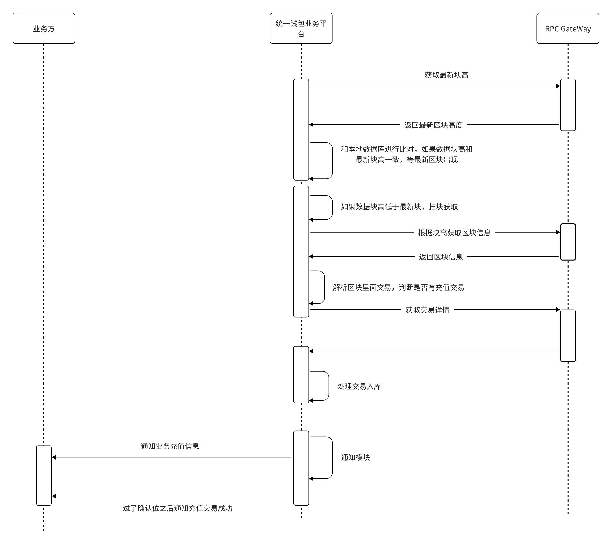

# 充值业务

- 获取最新区块链
- 获取本地数据最高区块
- 链上的最新和数据库的最高区块进行比较
- 若本地数据块高 = 链上最新区块高度，等待最新区块出现
- 若本地数据块高 > 链上最新区块高度, 进行交易回滚
- 若本地数据块高 < 链上最新区块高度，
- 根据区块高度获取交易列表
- 解析交易之后
    - 若 from 是外部地址，to 地址是内部用户地址，充值； 调用回调接口通知业务方
    - 若 from 地址是用户地址，to 地址是热钱包地址，归整； 调用回调接口通知业务方
    - 若 from 地址是热钱包地址，to 地址是外部用户地址，提现； 调用回调接口通知业务方
    -  若 from 地址是热钱包地址，to 是冷钱包地址，热转冷； 调用回调接口通知业务方
    -  若 from 是冷钱包地址，to 地址是热钱包地址，冷转热； 调用回调接口通知业务方