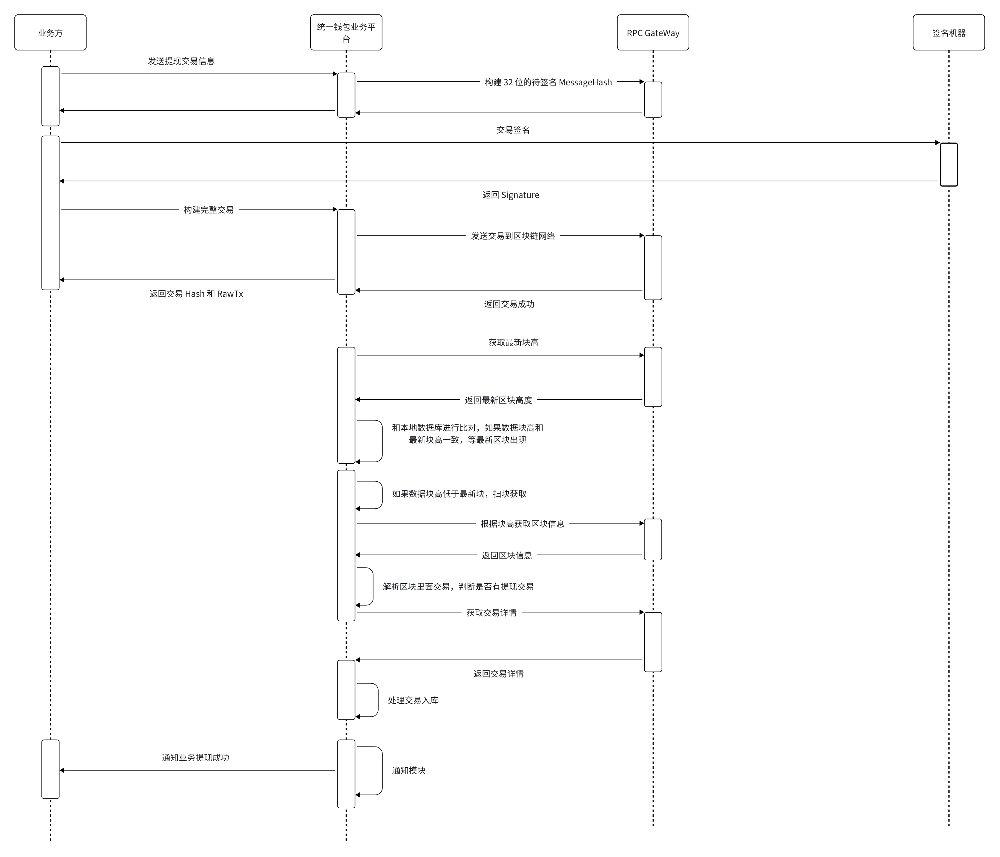

# 提现业务

- 用户发起提现，业务方将提现交易发送 DappLink 钱包服务
- 业务方将交易发送到 multichain-sync-account/utxo  进行构建待签名的消息，multichain-sync-account/utxo 调度 wallet-chain-account/utxo 返回待签名的消息
- 业务方将待签名的消息发送给自己部署的签名进行签名
- 业务方将 signature 和 交易 ID 发送到你 multichain-sync-account/utxo ，multichain-sync-account/utxo  调度 wallet-chain-account/utxo 构建完整交易并发送到区块链网络，将完整交易和交易 Hash 返回给业务端
- 提现进程会去扫描这些交易发送到区块链网络
- 扫链部分参考充值模块