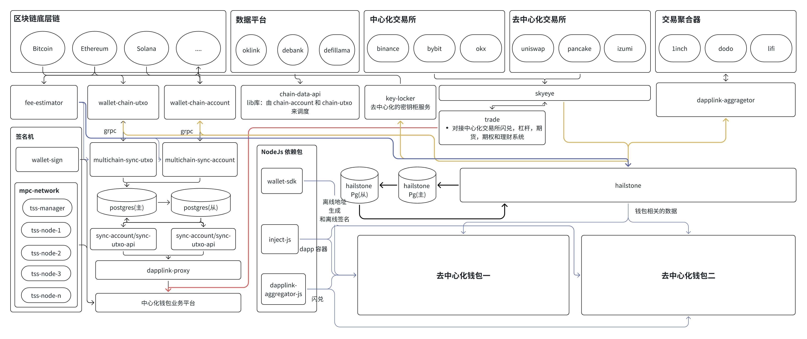

# DappLink 核心功能

DappLink 一键发钱包平台由多个核心组件构成，以确保安全性、可扩展性和高性能

key-locker：链上密钥管理工具，支持 Ethereum、IPFS、Arweave 等区块链
签名机：DappLink 的签名机支持 CloudHSM 和 TEE（可信执行环境）两种模式，目前支持 ECDSA 和 EdDSA两种加密算法，目前已被多家厂商采用。签名机确保交易签名的安全性，并可适配不同的安全需求

MPC 网络：DappLink 采用 MPC 和 ZK 技术，去中心化密钥管理机制，动态签名委员会，适用于企业级钱包和合规托管需求

wallet-sdk: 提供多链支持的标准化接口，使开发者可以快速集成钱包功能；主要包括：
- 地址生成
- 交易签名
- 资产查询
- 链上交互

统一 gRPC 接口服务：提供 gRPC 统一接口，整合第三方数据平台，支持不同类型的区块链模型，这一组件提供了一致化的 API 设计，使不同类型的区块链可以通过相同接口进行交互。
- chain-data-api: 对接第三方平台的统一钱包 API，主要服务于 HD 钱包
- wallet-chain-account：适用于账户模型（Ethereum、Solana 等）
-  wallet-chain-utxo：适用于 UTXO 模型（Bitcoin、Litecoin、BCH、BSV 等）

统一扫链服务：DappLink 具备完善的链上数据同步和监控能力，支持账户模型和UTXO 模型的交易处理；针对账户模型的链：multichain-sync-account 和 针对 UTXO 模型的链 multichain-sync-utxo, 这一模块确保了钱包可以实时跟踪链上变化，并高效处理资产流转；本模块主要有以下功能：
- 业务配置
- 地址导出
- 充值 & 提现
- 资产归集
- 热转冷、冷转热
- 交易回滚等业务逻辑

数据与交易服务
- skeye：统一行情服务，集成 CEX 与 DEX，提供实时市场数据
- trade：支持中心化钱包的闪兑、杠杆、期货和期权保险，未来可对接交易所
- 去中心化闪兑：通过调度 Aggregator API 提供最优交易路径，提高兑换效率

Hailstone 业务中台：Hailstone 是 DappLink 体系中的业务中台，负责与上层业务系统对接，提供高效、稳定的中间层服务，Hailstone 使得钱包可以无缝接入各种 Web3 应用，提升业务整合能力。主要功能包括：
-  用户账户管理
-  交易风控
-  数据分析
-  跨链交互
- Dapp 聚合

