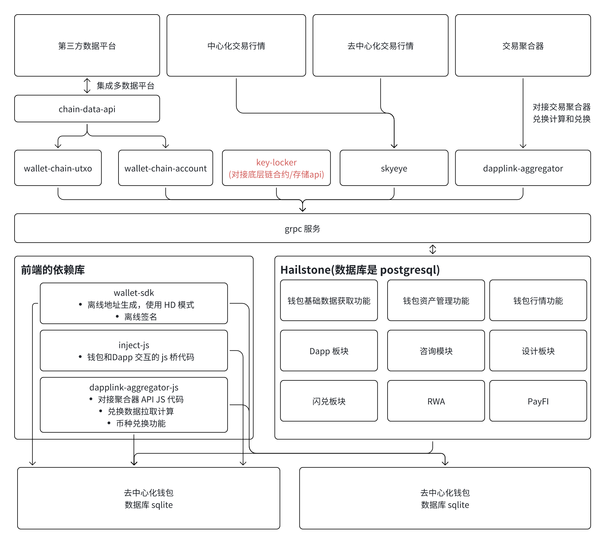
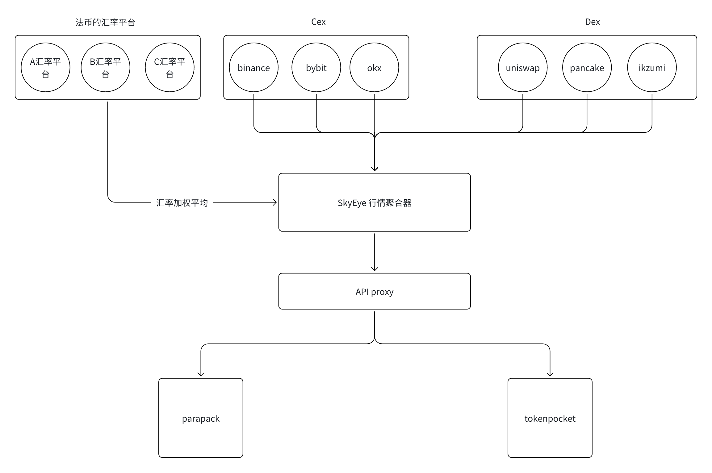
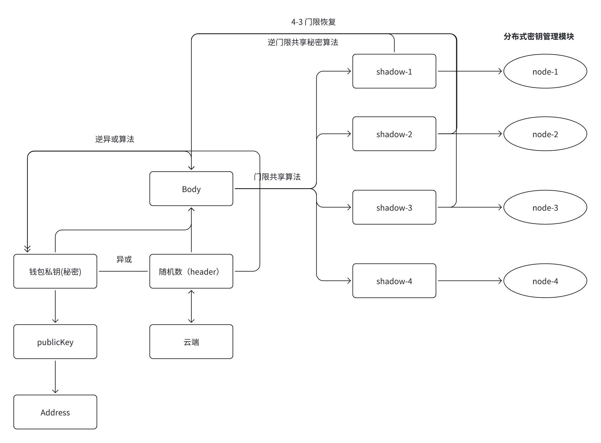

# 去中心化钱包业务

数据采集与整合：从第三方数据平台、中心化交易所行情、去中心化交易所行情和交易聚合器获取数据。
- 通过 chain-data-api 进行多数据源的整合处理
- skyeye 和 dapplink-aggregator 负责交易计算、交换和汇总，为交易聚合器提供数据支持

区块链账户与 UTXO 处理：
- 通过 wallet-chain-utxo 处理 UTXO 账户数据。
- 通过 wallet-chain-account 处理基于账户模型的区块链数据。
- key-locker 去中心化的密钥柜组件

Hailstone 钱包中台服务
- 钱包基础数据获取功能：用户钱包的基本信息管理
- 钱包资产管理功能： 钱包资产的存储和管理
- 钱包行情功能：实时查询钱包资产的市场价格
- Dapp 板块：提供 Dapp 相关的业务支持
- 咨询模块：提供市场或产品咨询信息
- 闪兑板块：提供快速兑换功能
- RWA（现实世界资产）：支持现实资产的链上映射
- PayFI： 支付金融相关功能

前端依赖库，提供钱包交互和交易聚合功能：
- wallet-sdk： 生成离线钱包地址，支持 HD（分层确定性）模式， 进行离线签名。
- inject-js：处理钱包和 Dapp 交互的 JS 桥代码
- dapplink-aggregator-js：提供交易聚合器 API 的 JS 代码；进行先验数据提取和计算，支持币种兑换功能
- parapack（SQLite） 和 fishcake（SQLite） 作为本地数据存储，可能用于缓存或者轻量级数据存储需求

## 一.行情服务业务

- 定时拉取各个交易所的行情
- 获取到交易对的行情之后，去除最低和最高值
- 加权平均计算，根据自己计算来数据计算 24 涨幅
- 再跟交易所的交易量计算全网 24 小时总交易量和平均交易

## 二.密钥托管的服务业务

- 钱包私钥通过异或算法与随机数结合成 Body
- 随机数做为 Header 上传到云端
- Body 使用门限共享算法被拆分为多个 shadow 并分别存储到多个分布式节点中。
- 进行恢复时，通过逆门限共享秘密算法结合一定数量的 shadow 恢复出 Body。
- 从云端获取 Header, Body 与 Header 通过逆异或算法恢复出原始钱包私钥。
