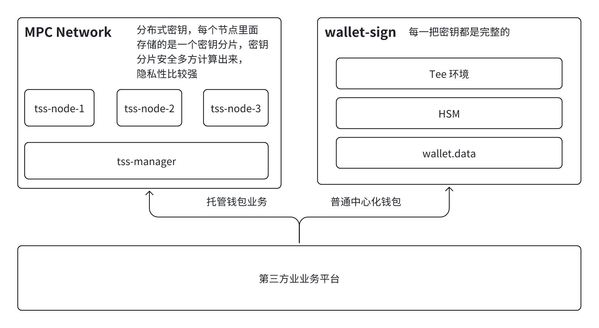

# 统一签名服务业务流程



该服务部署在 TEE 环境，通常由业务方自己来部署， DappLink 提供技术支持；支持的接口如下

```
rpc getSupportSignWay(SupportSignWayRequest) returns (SupportSignWayResponse) {}
rpc exportPublicKeyList(ExportPublicKeyRequest) returns (ExportPublicKeyResponse) {}
rpc signTxMessage(SignTxMessageRequest) returns (SignTxMessageResponse) {}
```
- getSupportSignWay:查看签名方式是否支持
    - ECDSA
        - secp256k1
        - secp256r1
    - EdDSA
        - Ed25519
        - tm-ed25519
    - RSA
- exportPublicKeyList:  keygen 完成之后把公钥吐出来
- signTxMessage：交易签名的函数

