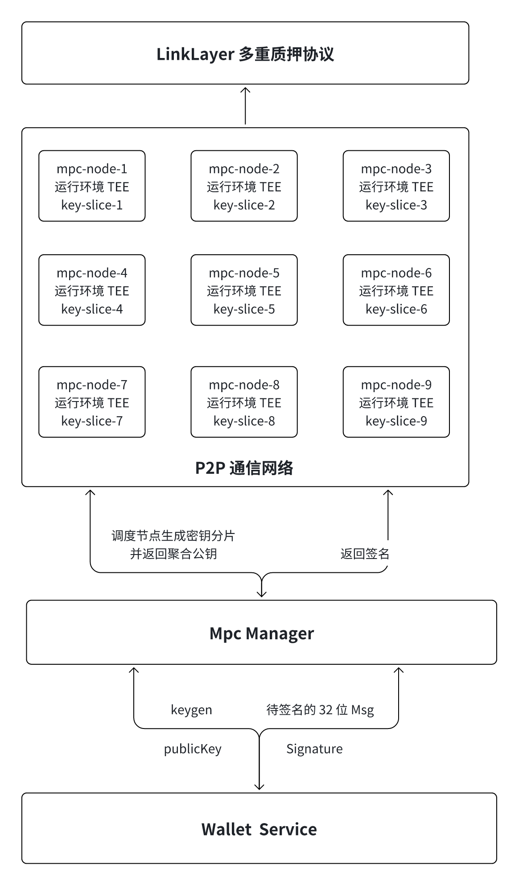

# MPC 托管系统

- LinkLayer 多重质押协议: 作为整个系统的顶层协议，负责协调 MPC 节点加入退出管理，通过质押模型和承诺签名来保证网络的安全和可靠。
- MPC 节点层: 由多个运行在 TEE 环境中的 MPC 节点组成，每个节点持有密钥的一个分片（key-slice）。
- mpc-node-1 到 mpc-node-9: 各节点运行在 TEE 环境下，密钥分片被分布式存储在各节点中，保证单个节点无法直接还原完整密钥。
- TEE（受信执行环境）: 提供硬件级别的安全性，防止恶意行为对密钥分片的篡改或泄露。
-  P2P 通信网络
    - 节点之间通过点对点通信网络协同工作。
    - 支持密钥生成（keygen）和签名（signature）操作的分布式计算。
    - 密钥生成：各节点协作生成密钥分片，并通过计算聚合公钥。
    - 签名：各节点接收待签名消息，独立计算后将结果返回，最后聚合为完整签名。
    -  MPC Manager：负责管理 MPC 操作，包括密钥生成和签名请求。
- 核心功能
    - keygen：触发密钥生成流程，返回生成的公钥（publicKey）。
    - Signature：接收待签名的 32 位消息（Msg），协调 MPC 节点完成签名过程并返回结果。
- Wallet Service
    - 面向业务层的服务模块。
    - 与 MPC Manager 交互，发送密钥生成和签名请求。
    - 提供钱包服务的核心功能，例如密钥管理和交易签名。

